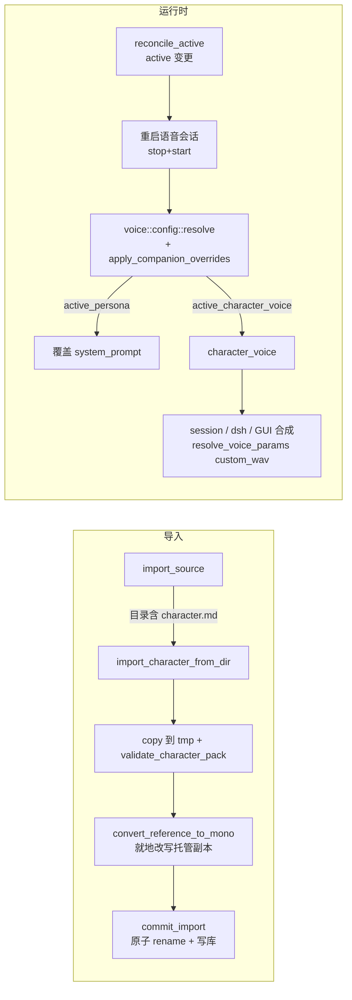

# 角色包导入功能技术方案

> 状态：已评审通过（2026-08-26）。本文档是实施的基准，实施过程中如有偏差需同步更新本文档。

## 1. 背景与需求

ZapMomo 当前支持 Live2D（`format="cubism3"`）和 GIF（`format="gif"`）两类伙伴，但它们只是「外观」——人设（system prompt）和音色都是全局配置，与伙伴无关。

本功能支持用户导入「角色包」目录，把外观 + 人设 + 音色打包为一个伙伴：

```
furina/
├── character.md            # 必选：角色人设（作为 LLM system prompt）
├── character.png           # 必选：静态立绘
└── voice/                  # 可选：TTS 音色克隆参考
    ├── reference.wav       # 参考音频
    └── reference.txt       # 逐字转写（ZipVoice 克隆必填）
```

### 1.1 校验规则

| 检查项 | 规则 |
|---|---|
| `character.md` | 必须存在且 trim 后非空；角色名从 H1（`# 名字`）提取，缺失回退目录名 |
| `character.png` | 必须存在，前 8 字节 == `\x89PNG\r\n\x1a\n` |
| `voice/` | 可选；存在则 `reference.wav` + `reference.txt` 必须成对（缺其一报错）；wav 校验 RIFF/WAVE 头，txt 非空 |

### 1.2 已确认的产品决策

1. **人设覆盖全局**：active 伙伴有 character.md → 完全替代 `[llm].system_prompt`；切回普通伙伴自动回退全局配置。
2. **音色条件生效**：active 伙伴带 voice/ 且当前 TTS 模型 `uses_reference_audio()`（ZipVoice/OmniVoice）→ 克隆音色；否则走现有全局音色逻辑，优雅降级。
3. **静态展示**：PNG 复用 GifStage（原生 ``）渲染，本期不做动效。
4. **切换时重启会话**：active 变化时若语音会话运行中则 stop+start（复用 `set_microphone` 模式），代价是会话短暂中断、历史清空，换来人设语义干净。

## 2. 现状分析

### 2.1 伙伴库（`src/companion.rs`）

- `CompanionModel`：`id/name/source_path/model_dir/model_file/format/imported_at`；`format` 为判别字段（`"cubism3"` / `"gif"`）。
- 导入：`import_source` 统一入口（file → GIF，dir → Live2D），prepare（复制到 `.tmp-` + 校验，不持锁）→ `commit_import`（锁内二次去重 + 原子 rename + RAII 清理）。托管目录 `~/.zapmomo/companions/{id}/` 整目录复制，源删除后伙伴仍可用。
- `validate_managed` 按 format 分派轻量校验；`find_cover_image` 探测封面。

### 2.2 渲染（`src-tauri/frontend`）

- `CompanionRoot.tsx` 按 `format === "gif"` 分发 `GifStage`（原生 ``，天然支持 PNG）/ `Live2dStage`（PIXI）。
- format 经 `get_live2d_config` / `live2d-model-changed` 事件流到前端。

### 2.3 人设与音色（当前均为全局）

- system prompt 唯一来源：`settings.toml [llm].system_prompt`，语音会话启动时解析进 `ResolvedSessionConfig` **快照**，运行中不感知 settings 变更。
- 音色优先级：`per-call voice_id`（语音会话 = `[voice].voice`）> `[tts].voice` > 模型默认。ZipVoice 零样本克隆需 `参考音频 + 逐字转写`。
- dsh 播报与 GUI 合成每次都重新调 `resolve_voice_params`，天然动态；语音会话的 voice 在 `SynthHandle` 构造时固化。

### 2.4 关键约束

- sherpa-onnx 的 `Wave::read` **只接受单声道** wav，立体声直接报错 → 立体声→单声道转换必须在导入管线完成；采样率不动（合成时 `normalize_reference`（src/tts/mod.rs）已解决 48k→24k 重采样崩溃）。
- `hound` 3.5 已在依赖中，用于解码立体声 + 混音 + 写单声道 wav。
- 语音会话无 restart command；唯一重启先例 `set_microphone`（src-tauri/src/lib.rs）的 stop+start。

## 3. 技术方案

### 3.1 总体架构



### 3.2 数据模型

- 新 format：`"character"`（语义是「角色包」，区别于泛泛静态图）。
- `model_file` 指向托管目录内 `character.png` 绝对路径 → `quick_valid`、asset scope、前端 `toAssetUrl` 零改动可用。
- 人设/音色**不加库字段**：托管目录已有文件，运行时按约定文件名探测（与 `find_cover_image`/`save_cover` 哲学一致），零 schema 变更，用户直接编辑托管的 character.md 下次会话即生效。

新增探测 API（`src/companion.rs`，返回 `Option`，IO 失败 warn + 降级 None）：

```rust
pub fn active_persona() -> Option<String>;
pub struct CharacterVoice { pub wav: PathBuf, pub text: String }
pub fn active_character_voice() -> Option<CharacterVoice>;
```

### 3.3 导入分派

```
file → import_gif_from_file（不变）
dir  → 含 character.md → import_character_from_dir（角色包优先于 Live2D）
       否则           → import_from_dir（Live2D，不变）
```

含 character.md 但 character.png 缺失/损坏时报角色包专属错误，**不回退** Live2D 分支（避免误导性报错）。

### 3.4 人设/音色注入

`src/voice/config.rs`：

```rust
pub fn apply_companion_overrides(cfg: &mut ResolvedSessionConfig) {
    if let Some(p) = crate::companion::active_persona() {
        cfg.llm.system_prompt = p;   // 完全覆盖；不写盘，切回自然回退全局
    }
    if cfg.tts.uses_reference_audio()
        && let Some(v) = crate::companion::active_character_voice() {
        cfg.character_voice = Some(v);
    }
}
```

调用点：`start_voice_session_impl`（resolve 之后、preflight 之前）与 CLI `run_cli`（resolve 之后）→ GUI 与 CLI `voice run` 同行为。

语音会话两处 `resolve_voice_params`（`new_with_parts` / `refresh_tts_if_switched`）把 `cfg.character_voice` 作 `custom_wav`/`custom_text` 传入（该参数已是最高优先级）。非克隆模型时 `resolve_voice_params` 不看 custom_wav，自动降级全局音色。

dsh 播报（`announce.rs`）与 GUI 合成（`synthesize_tts`）每次构建时探测角色音色；GUI 合成中用户显式参数优先于角色包（设置页试听不被劫持）。CLI `tts run` 不动（显式工具语义）。

### 3.5 切换联动

`reconcile_active` 在幂等早退之后、函数尾部追加：active 实际变更且语音会话运行中 → `stop_voice_session_inner` + `start_voice_session_impl`（`set_microphone` 同款模式；失败仅 warn）。三个调用方（设置页 set_active、托盘切换、导入自动 active）自动获得该行为；`list_companions` 的 reconcile 因幂等早退不误触发。切回普通伙伴同样重启 → 无 override → 自动回退全局。

### 3.6 前端

- 类型扩展：`format: "cubism3" | "gif" | "character"`；`CompanionModelInfo` 加 `has_persona`/`has_voice`（后端 `build_view` 探测填充）。
- `CompanionRoot.tsx`：`format === "gif"` 两处判断改为共享 helper `isStaticImage(f) = f === "gif" || f === "character"`；GifStage 零改动。
- `CompanionPage.tsx`：导入复用目录选择器（后端按内容自动识别），预览走 img 分支，伙伴卡片按 has_persona/has_voice 显示「人设」「音色」Badge。

## 4. 实施方案

| 阶段 | 任务 | 验收标准 |
|---|---|---|
| 1. 导入管线（Rust） | CHARACTER_FORMAT/is_character、validate_character_pack、convert_reference_to_mono、extract_character_name、import_character_from_dir、import_source 分派、validate_managed 分支、探测 API、build_view 字段 | companion.rs 全部新单测绿；`cargo test` 无回归 |
| 2. 渲染（前端） | 类型扩展、isStaticImage、预览/导入文案、Badge | 导入角色包后桌宠窗口显示立绘；伙伴页预览与封面正确；Vitest 绿 |
| 3. 人设 | active_persona、apply_companion_overrides、两个调用点、reconcile_active 重启块 | 会话运行中切到角色包 → 自动重启且 prompt 生效；切回 → 回退全局；CLI `voice run` 同行为 |
| 4. 音色 | character_voice 字段消费、dsh、GUI 合成 | ZipVoice 下克隆音色生效；Kokoro 自动降级；48k 立体声样本可用 |
| 5. 打磨 | 文档/CHANGELOG/错误文案走查 | `cargo fmt --check && cargo clippy -- -D warnings && cargo test` 全绿；前端 `tsc -b` + Vitest 全绿 |

依赖关系：1 → 2/3 可并行；3 → 4。

### 4.1 测试策略

- Rust（`run_with_temp_home` 风格）：导入成功（format/model_file/name/首导入 active）；H1 缺失回退与超长截断；缺 md 走 Live2D 分支报错；md 空白/png 坏签名/voice 不成对 → 角色包专属错误；立体声→单声道断言（channels==1、采样率保留、帧数不变；1ch 不改写）；model3.json 与 character.md 同目录 → character 优先；失败无 tmp 残留；set_active/sanitize character 分支；探测 API 有/无覆盖。
- 前端 Vitest：format "character" 渲染 GifStage 分支。注意 Vitest 4 坑：被 `new` 的 mock 不能用箭头函数，须 `vi.fn(function () {...})`。

### 4.2 边界与风险

1. **静态 PNG 无动作反馈**：本期接受（已确认），后续可加说话时浮动等 CSS 动效。
2. **人设是 prompt 载体**：用户自行导入，风险可控；UI 文案不暗示为官方内容。
3. **角色音色优先级**：压过 `[voice].voice` 与 CLI `--voice`，文档写明该语义。
4. **会话重启中断**：切换伙伴时运行中会话重启（历史清空），为已确认的产品取舍。
