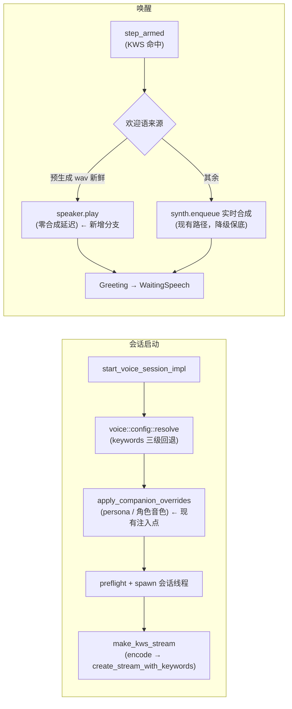
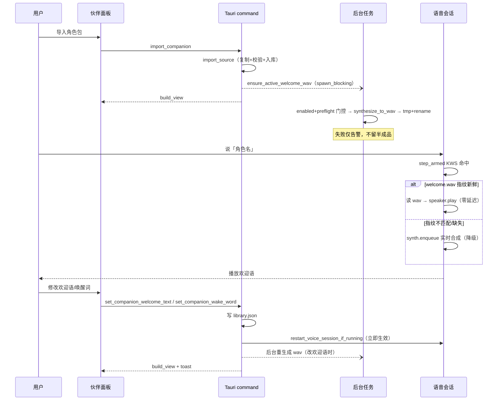

# 技术方案：角色级唤醒词与欢迎语

> 状态：已评审通过（2026-08-30）
> 关联模块：`src/companion.rs`、`src/voice/`、`src-tauri/src/lib.rs`、伙伴面板前端
> 前置调研结论：所有关键基础设施（唤醒词热切换、离线合成落盘、会话重启钩子、角色级配置先例）均已存在，本方案为「组装已有积木」。

## 1. 对现状的分析

### 1.1 唤醒词：全局单一配置

- 唤醒词存于 `settings.toml [kws].custom_keywords`（会话级自定义词，`/` 分隔多词；`None` = 模型内置），换角色需手改配置。
- 语音会话的 KWS 流在会话启动时一次性构建（`VoiceSession::new_with_parts` → `make_kws_stream`，`src/voice/session.rs`）：`cfg.keywords` 经 `kws::token::encode_custom_keywords` 编码（汉字→ppinyin / 英文→ARPAbet/BPE）后 `kws.create_stream_with_keywords` —— **sherpa-onnx 支持换词不重建引擎**，关键词解析成本在流级别。
- 关键词解析链（`voice::config::resolve`）：`cli.keywords` > `[voice].keywords` > `[kws].custom_keywords`。
- 独立 KWS 监听（非语音会话）的 `start_listen_impl` 以调用方参数接收 keywords，线程生命周期内不变，修改需 stop→start。
- 现有缺口：`[kws].custom_keywords` 无重启生效路径（会话/监听运行中修改均不生效）。

### 1.2 欢迎语：全局文案 + 唤醒时实时合成

- 全局文案 `[voice].welcome_text`（默认「你好，我在。」）；唤醒 → `sanitize_for_tts` 清洗 → `SynthHandle.enqueue` 实时合成 → Greeting 状态播放 → 等用户说话（`welcome_wait_timeout` 缺省 8s）。
- **唤醒瞬间实时合成引入秒级延迟**（TTS 引擎按需构建；audiocpp sidecar 冷启动 1~3s + 合成 RTF<1）。
- 角色音色三级解析已存在（`companion_voice_in`：托管目录 `voice/reference.wav+txt` > 音色库绑定 `voice_id` > 全局默认），欢迎语尚无角色级概念。

### 1.3 角色元数据：集中式清单

- `~/.zapmomo/companions/library.json`（`CompanionLibrary`）为唯一清单；每角色条目 `CompanionModel` 已有角色级自定义字段先例：`voice_id`（音色绑定）、`layout`（窗口布局），均为 `serde(default)` 的 `Option` 字段，老文件零迁移。
- 角色托管目录 `{model_dir}/` 存放资产：`character.md`（人设）、`character.png`/`cover.png`、`sprites/`、`voice/reference.*`（音色克隆参考）。
- 生命周期操作齐备：`rename`（只改 name）、`set_active`（经 `reconcile_active` 联动重启会话）、`remove`（删整个托管目录）、`relocate_payload`（目录搬迁，路径重写）。
- 修改角色音色绑定的现有行为范式（`set_companion_voice` command）：写库 → 若为 active 伙伴则 `restart_voice_session_if_running`（stop→start，重启清对话历史）→ 返回 `build_view`。

### 1.4 结论

| 需求 | 现状基础 | 缺口 |
| --- | --- | --- |
| 角色级唤醒词 | `create_stream_with_keywords` 热切换、`apply_companion_overrides` 注入点 | 唤醒词解析函数、字段存储、联动重启 |
| 唤醒词默认=角色名 | `CompanionModel.name` | 默认值语义与不可编码名字的回退 |
| 欢迎语预合成 wav | `TtsEngine::synthesize_to_wav`（同步、纯本地）、`audio::write_wav_f32` | 派生资产管理（指纹/新鲜度）、播放分支 |
| 唤醒后直接播放 | `Speaker::play(Vec<f32>, u32)`（rodio） | wav→f32 读取入口 |
| 面板自定义 | `set_companion_voice` command + 音色 Select UI 完整范式 | 两个新命令与 UI 区块 |

## 2. 当前架构分析

语音链路（KWS→ASR→LLM→TTS）的核心扩展点集中在两处：



- `apply_companion_overrides` 由 CLI（`run_cli`）与 GUI（`start_voice_session_impl`）两条路径共同经过，且在角色切换时经 `restart_voice_session_if_running` 自动重跑 —— **唤醒词/欢迎语的角色级覆盖注入此处即可全链路生效**。
- 伙伴数据流：command（spawn_blocking 写 library.json）→ `restart_voice_session_if_running` → 返回 `build_view`，前端用返回视图直接替换列表（不经二次拉取）。

## 3. 技术方案

### 3.1 设计决策（已评审确认）

| 决策点 | 结论 | 理由 |
| --- | --- | --- |
| 配置存储 | `library.json` 扩展 `wake_word`/`welcome_text` 两个 `Option` 字段 | 与 `voice_id`/`layout` 同模式；单一数据源；rename/搬迁/删除的锁与读写现成；零迁移 |
| 预生成 wav 位置 | `{model_dir}/voice/welcome.wav` + 旁车 `welcome.json`（**不含绝对路径**） | 派生资产随目录 `relocate`/`remove` 天然一致 |
| 修改后生效时机 | 立即 `restart_voice_session_if_running`（会话）+ stop→start（独立监听） | 与音色绑定行为一致；接受清对话历史副作用 |
| 唤醒词默认值 | 未自定义时动态取 `name`（rename 自动跟随） | 「激活即换词」的产品语义 |
| 名字不可编码 | 回退全局 keywords 链 + 前端提示 + 保存时预校验报错 | 优雅降级，用户在保存时即知 |
| 默认欢迎语文案 | `你好，我是{name}。` | 唤醒词喊的是角色名，欢迎语回报名字形成身份闭环 |
| wav 新鲜度 | `(生效文本, tts 模型/backend, speed, voice_id, 角色音色 wav stat)` 指纹；不匹配自动后台重生成，唤醒降级实时合成 | 覆盖改文案/改音色/换模型/换参考音频全部失效场景，一条降级路径兜底所有边界 |

### 3.2 数据模型

```rust
// src/companion.rs —— CompanionModel 新增
#[serde(default, skip_serializing_if = "Option::is_none")]
pub wake_word: Option<String>,     // None = 跟随 name
#[serde(default, skip_serializing_if = "Option::is_none")]
pub welcome_text: Option<String>,  // None = DEFAULT_WELCOME_TEMPLATE 展开

pub const DEFAULT_WELCOME_TEMPLATE: &str = "你好，我是{name}。";
const MAX_WAKE_WORD_CHARS: usize = 20;
const MAX_WELCOME_CHARS: usize = 200;

pub fn effective_wake_word(m: &CompanionModel) -> String;      // wake_word.unwrap_or(name)
pub fn effective_welcome_text(m: &CompanionModel) -> String;   // 模板 .replace("{name}", &name)
pub fn active_model_fast() -> Option<CompanionModel>;
pub fn active_wake_word() -> Option<String>;
pub fn set_wake_word(id, Option<&str>) -> Result<CompanionLibrary, String>;      // 照 set_voice_binding
pub fn set_welcome_text(id, Option<&str>) -> Result<CompanionLibrary, String>;

pub struct WakeWordResolution {
    pub word: Option<String>,            // 最终生效；None = 模型内置
    pub companion_word: Option<String>,  // 角色级词
    pub companion_ok: bool,              // 能否编码为 token
}
/// active 伙伴唤醒词 > fallback（resolve 的合并结果）> None；
/// 角色词 encode 失败 → 回退 fallback。**角色词压过 CLI --keywords**（激活即换词语义）。
pub fn resolve_wake_word(fallback: Option<&str>, tokens: &Path) -> WakeWordResolution;
```

```rust
// src/companion_welcome.rs（新模块）
pub struct WelcomeMeta { text: String, fingerprint: String, sample_rate: u32, generated_at: String }
pub fn clip_fingerprint(cfg: &ResolvedSessionConfig) -> String;  // sha256 前 16 hex；音色 wav 用 stat(len,mtime) 不读内容
pub fn is_fresh(model_dir, expected_fp) -> bool;                 // 不读样本
pub fn load_fresh(wav, meta, expected_fp) -> Option<(Vec<f32>, u32)>;  // 唤醒线程调用，毫秒级
pub fn generate(cfg, model_dir) -> Result<WelcomeMeta, String>;  // 同步阻塞；调用方必须 spawn_blocking；
     // 内部：tts.enabled + tts::config::preflight 门控 → sanitize_for_tts（空回退原文）→
     // resolve_voice_params → synthesize_to_wav → tmp+rename 原子写 wav+json

// src/audio.rs
pub fn read_wav_mono(path) -> Result<(Vec<f32>, u32), String>;   // 照 convert_reference_to_mono 解码模式
```

### 3.3 注入与播放

```rust
// src/voice/config.rs
pub struct WelcomeClip { wav: PathBuf, meta: PathBuf, fingerprint: String }
// ResolvedSessionConfig 新增：welcome_clip: Option<WelcomeClip>
// apply_companion_overrides 扩展（persona/音色原样保留）：
//   1. resolve_wake_word(cfg.keywords…) → cfg.keywords = r.word（回退时 warn）
//   2. cfg.welcome_text = effective_welcome_text(active)
//   3. cfg.welcome_clip = is_fresh(dir, fp).then(WelcomeClip{..})

// src/voice/session.rs —— step_armed 唤醒分支
enum WelcomeSource { Clip { samples: Vec<f32>, sample_rate: u32 }, Synthesize(String) }
fn resolve_welcome_source(cfg) -> WelcomeSource;
// Clip → speaker.play + welcome_played=true → Greeting（step_greeting 不改，等 drained 迁移）
// Synthesize → 现有 sanitize + synth.enqueue 路径
```

独立 KWS 监听：`start_listen_impl` 内部 keywords 先过 `companion::resolve_wake_word`，三处调用点签名不变自动生效；`get_kws_config` 加 `active_wake_word` 供前端提示。

### 3.4 Tauri 命令与联动

| 触发 | 写库 | 重启 | wav |
| --- | --- | --- | --- |
| 改唤醒词 `set_companion_wake_word` | `set_wake_word`（保存前预编码校验） | 会话 + 独立监听立即 | 不需要 |
| 改欢迎语 `set_companion_welcome_text` | `set_welcome_text` | 会话立即 | 后台重生成 |
| 改音色绑定 | `set_voice_binding`（现有） | 立即 | 后台重生成 |
| 改名 / 切换 active / 导入成为 active | 现有函数 | 经 `reconcile_active` | 后台 ensure |
| 启动 | — | — | setup reconcile 后 ensure |

`ensure_active_welcome_wav(app)`：新鲜则零开销返回；否则 spawn_blocking 后台 `generate`（best-effort，失败仅 warn）。`CompanionView` 新增 6 字段：`wake_word` / `wake_word_effective` / `wake_word_ok` / `welcome_text` / `welcome_text_effective` / `welcome_ready`（token 集合与 TTS cfg 每次 build_view 各算一次后按 model 循环）。

### 3.5 关键时序



## 4. 实施方案（分四阶段，每阶段独立可验收）

### 阶段 1：数据层（纯根 crate）

| 任务 | 文件 |
| --- | --- |
| CompanionModel 两字段 + effective_*/active_model_fast/active_wake_word/set_wake_word/set_welcome_text/resolve_wake_word | `src/companion.rs` |
| `read_wav_mono` | `src/audio.rs` |
| 新模块：指纹/is_fresh/load_fresh/generate | `src/companion_welcome.rs`（新） |
| `load_token_set`/`encode_keyword` 放宽 `pub(crate)` | `src/kws/token.rs` |
| 模块注册 | `src/lib.rs` |

**验收**：`cargo fmt --check && cargo clippy -- -D warnings && cargo test` 全绿，存量零回归。

### 阶段 2：会话注入与唤醒直播（纯根 crate）

| 任务 | 文件 |
| --- | --- |
| `welcome_clip`/`WelcomeClip` 字段 + `apply_companion_overrides` 四注入 | `src/voice/config.rs` |
| `WelcomeSource` + `resolve_welcome_source` + `step_armed` 分支 | `src/voice/session.rs` |

**验收**：`cargo test`；`cargo run -- voice run` 手动：无角色行为不变，有角色日志出现「已应用角色唤醒词 X」。

### 阶段 3：Tauri 命令与联动

| 任务 | 文件 |
| --- | --- |
| 两命令 + 注册；`ensure_active_welcome_wav` + 5 触发点；`CompanionView`/`build_view` 6 字段；`start_listen_impl` 解析；`get_kws_config` 加 `active_wake_word` | `src-tauri/src/lib.rs` |

**验收**：`cargo check -p zapmomo-app && cargo clippy -p zapmomo-app -- -D warnings`。

### 阶段 4：前端

| 任务 | 文件 |
| --- | --- |
| 类型 + invoke 包装 + 两个 setter | `types/tauri.ts`、`lib/tauri.ts`、`hooks/useCompanionLibrary.ts` |
| 「唤醒与欢迎」区块（唤醒词 Input onBlur 提交 + 不可编码红提示；欢迎语 Input + 生成中灰提示） | `pages/CompanionPage.tsx` |
| 「当前唤醒词由角色接管」提示 | `components/kws/KwsBasicConfig.tsx` |
| vitest 用例 | 对应 test 文件 |

**验收**：`tsc -b`、`vitest run`、biome（仅改动文件）；端到端手动验收。

## 5. 测试计划

- **根 crate 单测**（CI 覆盖）：字段 serde roundtrip（老 JSON 无字段→None）；effective_* 默认/自定义；set_* 回环与超长报错；`resolve_wake_word` 三分支；`clip_fingerprint` 敏感性；is_fresh/load_fresh 回环与损坏路径；`read_wav_mono` mono/stereo/Float/坏文件；`apply_companion_overrides` 三注入；`resolve_welcome_source` 三分支；`generate` 用 `from_audiocpp_for_test` + `spawn_stub_wav` 端到端。
- **前端 vitest**：两个 setter 的调用/视图替换/toast；提示行渲染。
- **端到端手动验收**：导入→后台生成落盘；喊角色名→立即播放（日志确认 clip 分支）；改欢迎语→先实时合成后 wav；改唤醒词→新旧词即时切换；不可编码名→回退提示；切音色→音色变化；删 TTS 模型→降级不卡死。

## 6. 风险与边界（均有降级路径）

| 情况 | 处理 |
| --- | --- |
| 名字不可编码 | 保存时预编码报错 + resolve 回退全局链 + 前端提示 |
| TTS 模型未下载/禁用 | generate 先门控直接跳过；唤醒走实时合成 |
| wav 生成中就唤醒 | 指纹不匹配→降级；tmp+rename 读不到半截文件 |
| GIF 伙伴 | 全格式生效（model_dir 均为目录，voice/ 子目录不影响 GIF 校验） |
| 角色音色被删/换 | 指纹含 (path,len,mtime) → 重生成；被删回退全局音色 |
| 清洗后文本为空 | 生成侧回退原文（同 step_armed 规则）；指纹按原文 |
| 并发快速保存 | 不持 COMPANION_LOCK 跨生成；tmp+rename 原子，最后胜出 |
| 存量用户可见变化 | 有 active 伙伴时欢迎语从「你好，我在。」变「你好，我是{name}。」（预期语义，CHANGELOG 注明） |

## 7. 明确不做（Future）

单角色多唤醒词 · 阈值按词长自适应 · 多条欢迎语轮播 · ack 提示音 · wav 跨采样率复用 · 托盘/右键展示唤醒词 · companion 级 welcome_wait_timeout/speed · CLI flag 优先级可配

> **已从 Future 升级实施**（2026-08-30）：**角色包声明文件 `character.json`**。
> 原因：默认名字靠「猜 character.md 的 H1 / 目录 basename」是启发式兜底，角色包
> 作为可分享格式应有声明式约定。实施为三层模型：
>
> | 层 | 存哪 | 谁写 | 随包流通 |
> | --- | --- | --- | --- |
> | A 声明 | 包内 `character.json` | 角色作者 | ✅ |
> | B 用户配置 | `library.json`（`wake_word`/`welcome_text`） | 导入者 | ❌ |
> | C 推导兜底 | 动态推导（H1 → 目录名 / 默认模板） | — | — |
>
> 优先级 **B > A > C**；导入时把 A 的 `wake_word`/`welcome_text` **预填**进
> library.json 条目（「作者建议初始值」语义，指纹/视图/解析链零改动）。格式：
> `{ "version": 1, "name": "芙宁娜", "wake_word": "水神", "welcome_text": "..." }`
> 全字段可选；**存在但解析失败 → 导入报错**（声明文件是格式约定，静默忽略会让
> 作者预设无声失效）。存量角色包无此文件照旧走 C 层。
