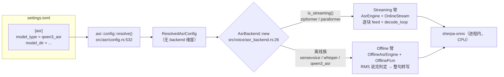
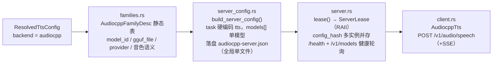
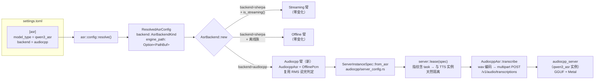
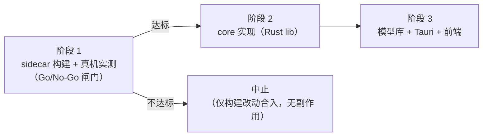

# 技术方案：ASR 接入 audio.cpp Qwen3-ASR 0.6B

| 项目 | 内容 |
| ---- | ---- |
| 文档状态 | 待审核 |
| 撰写日期 | 2026-08-27 |
| 关联先例 | PR #192（Qwen3-TTS 接入 audio.cpp） |
| 目标 | ASR 模型选择中新增 audio.cpp 后端的 Qwen3-ASR 0.6B（GGUF / Metal 加速） |

---

## 1. 现状分析

### 1.1 需求背景

ZapMomo 当前已支持 sherpa-onnx ONNX 版 Qwen3-ASR 0.6B（registry 条目 `asr-qwen3-0.6b`，`models/model_registry.json`），其描述中自述「CPU 解码较慢」——sherpa-onnx 在桌面端仅走 CPU 执行提供方，0.6B LLM 自回归解码的延迟对实时语音伙伴场景偏高。

上游 audio.cpp（`0xShug0/audio.cpp`，release-0.6.1）已原生支持 `qwen3_asr` 模型族，且 ZapMomo 已有完整的 audio.cpp TTS 接入先例（PR #192，PocketTTS / OmniVoice / VoxCPM2 / Qwen3-TTS 四个族）。将 Qwen3-ASR 0.6B 以 audio.cpp GGUF 形式接入 ASR 模型选择，可获得 Metal 加速收益，并为后续接入 Qwen3-ASR 1.7B（sherpa 侧无对应包）铺路。

### 1.2 上游能力核实（基于本地 `.audiocpp-src` @ release-0.6.1 源码）

| 核实项 | 结果 | 出处 |
| ---- | ---- | ---- |
| `qwen3_asr` 模型族 | ✅ 支持 Qwen3-ASR-0.6B / 1.7B-hf | `.audiocpp-src/src/models/qwen3_asr/` |
| GGUF 分发 | ✅ standalone 单文件（tokenizer/config sidecar 已嵌入 GGUF），q8_0 / f16 两精度 | `.audiocpp-src/model_specs/qwen3_asr.json` |
| GGUF 下载源 | ✅ HF `audio-cpp/audio.cpp-gguf` 仓 `Qwen3-ASR-0.6B-GGUF/qwen3-asr-0.6b-q8_0.gguf`（与现有 TTS GGUF 同仓） | 同上 `package_defaults.download` |
| Server ASR 端点 | ✅ `/v1/audio/transcriptions`（OpenAI 风格，multipart / JSON）+ `/v1/audio/transcriptions/live`（流式 partial） | `.audiocpp-src/app/server/runtime.h:141-152` |
| Server config | ✅ `models[]` 原生支持 `"task": "asr"` 模型项 | `.audiocpp-src/app/server/example.json:30-36` |
| 运行模式 | ✅ offline + streaming（含 partial results） | `model_specs/qwen3_asr.json` `modes` |
| 请求选项 | `language`（默认 auto）、`max_tokens`（512）、`return_timestamps`、`audio_chunk_mode` 等 | `model_specs_v1/qwen3_asr.json` `options.request` |
| 热词 | ❌ 无 hotwords 选项 | 同上（sherpa 版热词能力在 audio.cpp 路径丢失，见 §3.8） |
| 已知限制 | 量化会降低自动语种识别可靠性（转写质量不受影响，可用 `language` 显式指定兜底） | `.audiocpp-src/docs/models/qwen3.md` 末尾 |

### 1.3 ZapMomo 侧现状

- **ASR 链路无 backend 概念**：`AsrSettings`（`src/config/settings.rs:382-454`）只有 `model_type`；`AsrBackend`（`src/voice/asr_backend.rs:11-22`）仅有 sherpa 的 Streaming / Offline 两臂，按 `model_type.is_streaming()` 分派。
- **audiocpp 模块是 TTS-only**：`src/audiocpp/families.rs` 描述表（音色语义导向）、`server_config.rs`（`task` 硬编码 `"tts"`、models[] 单模型）、`client.rs`（仅 `/v1/audio/speech`）。
- **TTS 侧已有完整 backend 分派模板**（本方案的镜像对象）：
  - `TtsBackendKind::Sherpa|Audiocpp`（`src/tts/config.rs:194-221`）
  - `TtsSettings.backend` / `engine_path`（`src/config/settings.rs:515-518`）
  - backend 感知 preflight（`src/tts/config.rs:357-401`）与默认 provider 逻辑（`src/tts/config.rs:597-619`）
  - `set_selected_model` TTS 分支按 registry `runtime == "audiocpp"` 权威写入 backend（`src/model_library/mod.rs:422-469`）
- **sidecar 构建有族级裁剪**：`-DAUDIOCPP_MODELS=pocket_tts,omnivoice,voxcpm2,qwen3_tts`（`scripts/fetch-audiocpp-dev.sh:55`、`.github/workflows/release.yml:156`），当前不含 `qwen3_asr`。

---

## 2. 当前架构分析

### 2.1 ASR 链路（现状）



要点：

- `OfflinePcm`（`src/voice/asr_backend.rs:101-127`）负责 16k mono 缓冲与 `speech_seen` 守卫；`finalize` 时 `OfflineAsrEngine::transcribe_samples(&[f32], i32) -> Result<String, String>`（`src/asr/offline.rs:90-111`）整段转写。
- qwen3 热词链路：`AsrSettings.hotwords`（空格分隔）→ `src/asr/offline.rs:175-177` 转逗号格式 → sherpa C++ 端嵌入 chat 模板。
- 模型选择写入：`set_selected_model` ASR 分支（`src/model_library/mod.rs:395-421`）只写 `model_dir` + `model_type`（按 registry `asr_kind` 推导），无 backend。

### 2.2 audiocpp 模块（TTS-only 现状）



要点：

- `server.rs` 的实例管理（lease 计数、`config_hash` 指纹多实例并存、健康轮询、懒重启、孤儿清理、空闲回收）是**任务中立**的基建，可直接复用。
- `config_hash` 当前维度 = model_dir + model_type + provider + num_threads + engine 路径（`src/audiocpp/server.rs:204-212`），**不含 task 维度**。
- server config 落盘为全局单文件 `<data_dir>/engines/audiocpp-server.json`（`src/audiocpp/server_config.rs:72-74`），靠 manager 锁内串行 write+spawn 保护；单任务下可工作，双任务并存后存在竞态窗口（见 §3.3）。

### 2.3 差距汇总

| 层 | 现状 | 缺口 |
| ---- | ---- | ---- |
| sidecar 二进制 | 裁剪构建不含 qwen3_asr | 构建清单追加一族 |
| audiocpp 模块 | TTS-only（描述表 / config / client） | ASR 族描述、task 泛化、transcriptions 客户端 |
| ASR 配置 | 无 backend / engine_path | 镜像 TTS 增加 backend 维度 |
| ASR 引擎 | sherpa 两臂 | 第三臂（sidecar 离线整段） |
| 模型库 | 无 audiocpp ASR 条目 | manifest / registry / set_selected_model |
| 前端 | 运行时硬编码 sherpa-onnx | backend 感知展示 + 参数过滤 |

---

## 3. 技术方案

### 3.1 目标架构



### 3.2 核心设计决策与评估过程

#### 决策 1：kind + backend 正交，而非新增 kind 变体

候选方案：

- **方案 A（采纳）**：复用 `AsrModelKind::Qwen3Asr`，新增 `AsrBackendKind`（Sherpa 默认 / Audiocpp）+ `AsrSettings.backend`。同一模型两种运行时由 backend 区分。
- 方案 B：新增 `AsrModelKind::Qwen3AsrAudiocpp` 变体，kind 决定一切。

评估：方案 B 改动面更小（无需动 settings schema），但会破坏「kind 表达模型族、backend 表达运行时」的 TTS 既有正交语义——TTS 侧 audiocpp-only kind 之所以是独立枚举值，是因为那些族 sherpa **根本不能跑**；而 Qwen3-ASR 是两个运行时都能跑的同一模型，用 kind 区分会让 `asr_kind = "qwen3_asr"` 的 registry 数据（`models/model_registry.json`）产生两个语义重复的 kind，且前端 `asrMeta.ts`、目录探测、参数过滤全链路都要为「同族不同名」做特判。方案 A 与 TTS 模板完全同构，长期一致性更好。**采纳方案 A**。

#### 决策 2：server 实例走路线 A（每任务一实例），而非单实例多模型

候选方案：

- **路线 A（采纳）**：TTS 与 ASR 各自独立 `audiocpp_server` 进程。两者 model_dir / task 不同 → `config_hash` 不同 → 现有「按指纹多实例并存」机制天然支持。
- 路线 B：单 server 的 `models[]` 同挂 TTS + ASR 两模型。

评估：路线 B 需要 `build_server_config` 支持多模型、健康轮询校验多个 model_id、lease 入参改为组合配置、TTS/ASR 客户端共享同一 `ServerLease`——改动面明显更大，且引入 TTS 与 ASR 生命周期耦合（一方配置变化重启 server 会打断另一方）。路线 A 的代价是两份 GGUF 驻留内存（0.6B ASR q8 约 0.8GB + TTS 模型），桌面场景可接受，且 server 空闲回收机制（`IDLE_KEEPALIVE_MS`）对两实例同样生效。**采纳路线 A**；`config_hash` 必须加入 task 维度作自证隔离（防御性，见 §3.3）。

#### 决策 3：首版离线整段，live 流式留作后续

audio.cpp qwen3_asr 支持 streaming（partial results），但 ZapMomo 语音会话的离线臂形状（`OfflinePcm` 缓冲 + RMS 说完判定 + finalize 整句转写）已完整存在且久经测试。首版复用该形状，只把 `transcribe_samples` 的实现换成 HTTP 调用，可做到 sherpa 路径零变化、风险最小。`/v1/audio/transcriptions/live` 流式接入（边说边出 partial）作为后续独立迭代评估。

#### 决策 4：families 表拆分，新增 `asr_families.rs`

TTS 的 `AudiocppFamilyDesc` 含 VoiceSemantics / sample_rate / supports_streaming 等 TTS 语义字段，强行抽公共基类收益低、churn 大。新增 `src/audiocpp/asr_families.rs` 定义 ASR 专用描述表，TTS 表不动。

### 3.3 配置层

**`src/config/settings.rs`**（`AsrSettings`，382-454 行）尾部新增两字段（镜像 `TtsSettings` 513-518 行）：

```rust
/// ASR 引擎后端：sherpa（进程内，缺省）| audiocpp（audio.cpp sidecar 进程）
pub backend: Option<String>,
/// audiocpp 引擎二进制覆盖路径（开发/调试用）
pub engine_path: Option<String>,
```

**`src/asr/config.rs`**：

1. 新增 `AsrBackendKind` 枚举（镜像 `src/tts/config.rs:194-221`）：`Sherpa`（默认）/ `Audiocpp`，snake_case serde，`as_str()` / `parse_str()`。
2. `ResolvedAsrConfig`（165 行起）新增 `backend: AsrBackendKind` 与 `engine_path: Option<PathBuf>`。
3. `resolve()`（532 行起）：
   - backend 解析：settings 显式 > 缺省 Sherpa；非法值报「未知 ASR 后端： {v}（支持 sherpa / audiocpp）」。
   - kind 探测顺序：`settings.model_type` 显式 >（backend == Audiocpp 时）`asr_families::detect_gguf_in_dir()` 按 GGUF 文件名探测 > `detect_kind_from_dir()`（ONNX 探针，**本体不改**，保持 sherpa 探测语义零漂移）。
   - `Qwen3Asr` 臂按 backend 分叉：Sherpa 走现状 ONNX 五件套解析；Audiocpp 跳过 ONNX 字段解析（GGUF 定位由 `asr_families` 表完成，对齐 `src/tts/config.rs:580-584` 的取舍）。
   - 非法组合 fail-fast：backend == Audiocpp 且 kind 非 Qwen3Asr → resolve 报错「模型类型 {kind} 不支持 audiocpp 后端」。
   - provider 缺省：audiocpp 后端取族描述表 `default_provider`（`"metal"`，阶段 1 实测钉死）；显式配置优先。
4. 新增 backend 感知 preflight（镜像 `src/tts/config.rs:357-401`）：`preflight(cfg)` / `models_present(cfg)`。Sherpa 臂复用 `asr_files_present_for_kind`；Audiocpp 臂按族表 `required_files`（单 GGUF）校验，hint 用族表 `registry_hint`。
5. `AsrParamsPatch::apply_to`（676 行）新增 audiocpp 过滤规则（读取 `asr.backend` 感知后端）：

| patch 字段 | audiocpp 后端规则 | 理由 |
| ---- | ---- | ---- |
| `hotwords` | **静默丢弃不落盘** | audio.cpp qwen3_asr 无 hotwords 选项；前端已隐藏，这里兜底 |
| `language` | 正常落盘 | 映射请求 `language`（auto 不可靠时的显式兜底） |
| `num_threads` / `chunk_size` | 正常落盘 | server `threads` / 会话喂块与 RMS 判定仍消费 |
| `enable_endpoint` / `rule1-3` / `blank_penalty` | 正常落盘但不消费 | sherpa 流式专属；保留值以便切回不丢配置 |
| `enable_punctuation` / `use_itn` | 正常落盘但不消费 | qwen3 原生标点；SenseVoice 专属 |

### 3.4 audiocpp 模块任务中立化

**新增 `src/audiocpp/asr_families.rs`**：

```rust
pub struct AudiocppAsrFamilyDesc {
    pub model_id: &'static str,          // server config models[].id 与请求体 model 同源
    pub family: &'static str,            // "qwen3_asr"
    pub gguf_file: &'static str,         // "qwen3-asr-0.6b-q8_0.gguf"
    pub required_files: &'static [&'static str],
    pub default_provider: &'static str,  // "metal"（阶段 1 实测钉死）
    pub registry_hint: &'static str,     // "zapmomo asr install-model --registry-id asr-qwen3-0.6b-audiocpp"
}
pub const QWEN3_ASR_06B: AudiocppAsrFamilyDesc = ...;
pub fn asr_family_desc(kind: AsrModelKind) -> Option<&'static AudiocppAsrFamilyDesc>;
pub fn detect_gguf_in_dir(dir: &Path) -> Option<&'static AudiocppAsrFamilyDesc>;  // 外部导入探测
```

**`src/audiocpp/server_config.rs` 泛化**：引入任务中立的 `ServerInstanceSpec`：

```rust
pub struct ServerInstanceSpec {
    pub task: &'static str,              // "tts" | "asr"（进 models[].task 与 config_hash）
    pub model_id: String,
    pub family: String,
    pub model_path: PathBuf,             // GGUF 绝对路径
    pub mode: String,                    // TTS 沿用族 supports_streaming 翻转；ASR 首版恒 "offline"
    pub load_options: serde_json::Value, // TTS 沿用 desc.load_options()；ASR 首版 {}
    pub provider: String,
    pub num_threads: i32,
    pub model_dir: PathBuf,              // 指纹维度
    pub engine_path: Option<PathBuf>,
}
impl ServerInstanceSpec {
    pub fn from_tts(cfg: &ResolvedTtsConfig) -> Result<Self, String>;  // 内聚现 build_server_config 查表逻辑
    pub fn from_asr(cfg: &ResolvedAsrConfig) -> Result<Self, String>;
}
```

- `build_server_config(spec, port)` 替代现签名；`task` 字段（现 57 行硬编码 `"tts"`）改自 spec。
- **config 落盘改按指纹分文件** `audiocpp-server-<hash>.json`（现为全局单文件）：现状单文件在跨指纹双实例并存时存在 write→spawn 与子进程读 config 的竞态窗口，TTS+ASR 并存后必然双实例，顺带修掉。实例回收时删除对应 config 文件；孤儿清理（`server.rs reap_orphan_process`）追加扫描 `audiocpp-server-*.json` 残留。

**`src/audiocpp/server.rs` 泛化**：

- `lease(&ResolvedTtsConfig)` → `lease(&ServerInstanceSpec)`；`config_hash`（204-212 行）**首字段加 `spec.task`**（TTS 与 ASR 即使同 model_dir 也不撞指纹），其余维度不变。
- `wait_until_ready` 的 model_id 校验不变（`/v1/models` 对 asr task 同样列出 id）。
- `AudiocppTts::new` 改为内部 `ServerInstanceSpec::from_tts(&cfg)?` → `lease(&spec)`，行为等价（由现有 TTS 快照测试与 stub 全链路测试证明零行为变化）。

**`src/audiocpp/client.rs` 新增 `AudiocppAsr`**：

```rust
pub struct AudiocppAsr { cfg, desc, base_url, _lease, client }
impl AudiocppAsr {
    pub fn new(cfg: ResolvedAsrConfig) -> Result<Self, String>;       // preflight 前置 → spec → lease
    pub fn new_with_base_url(cfg, base_url) -> Self;                  // stub 测试注入
    pub fn transcribe(&self, samples: &[f32], sample_rate: i32) -> Result<String, AudiocppError>;
}
```

- 新增 `pub(crate) fn encode_wav(samples, sample_rate) -> Result<Vec<u8>, _>`：hound 写 `Cursor<Vec<u8>>`（16-bit PCM mono），与现有 `decode_wav`（client.rs:319）互为往返。
- `transcribe`：preflight（GGUF 缺失在 lease/spawn 之前报错，文案含 registry_hint）→ wav 编码 → multipart POST `/v1/audio/transcriptions`（字段 `file` + `model`；`cfg.language` 非空时带 `language`）→ 解析 JSON `{"text": ...}`。非 2xx 复用 `HttpStatus` 变体。

**`src/audiocpp/mod.rs`**：错误文案泛化——`ModelNotListed`（74 行）去掉「tts install-model」字样；新增 `EncodeWav` 变体或泛化 `DecodeWav` 文案。

### 3.5 ASR 引擎层：`AsrBackend` 第三臂

**`src/voice/asr_backend.rs`**：

```rust
pub(crate) enum AsrBackend {
    Streaming { engine: AsrEngine, stream: OnlineStream },      // 零变化
    Offline { engine: OfflineAsrEngine, pcm: OfflinePcm },      // 零变化
    Audiocpp { engine: AudiocppAsr, pcm: OfflinePcm },          // 新
}
```

- `new()`（26 行）分派优先级：`cfg.backend == Audiocpp` → 新臂；否则按 `is_streaming()` 走原两臂（sherpa 路径零变化）。
- `feed_chunk` / `reset`：与 Offline 臂同构（`pcm.push` / `pcm.clear`）；`decode_into`：空操作（无 partial）。
- `finalize`：与 Offline 臂共享「无语音直接清空返回」守卫，然后 `pcm.take()` → `engine.transcribe(&samples, cfg.sample_rate)`；错误时 `tracing::debug!` + 返回空串保持聆听（对齐 Offline 臂容错语义，网络/进程抖动不杀会话）。
- **不接标点后处理**：qwen3 原生输出带标点，`enable_punctuation` / CT Transformer 标点模型是为无标点输出的 zipformer 准备的。

`src/asr/offline.rs` 的 `OfflineAsrEngine` 不动；sherpa qwen3 热词转换（175-177 行）不动。

### 3.6 模型库接入

**`models/manifest.json`** 追加 raw 资产（镜像 296-306 行 qwen3-tts 条目）：

```json
{
  "name": "qwen3-asr-0.6b-audiocpp",
  "role": "asr-audiocpp-qwen3-06b",
  "version": "q8_0",
  "kind": "raw",
  "archive": "qwen3-asr-0.6b-q8_0.gguf",
  "source": "https://huggingface.co/audio-cpp/audio.cpp-gguf/resolve/main/Qwen3-ASR-0.6B-GGUF/qwen3-asr-0.6b-q8_0.gguf",
  "sha256": "<阶段 1 下载时实测>",
  "size_bytes": 0,
  "license": "Apache-2.0"
}
```

**`models/model_registry.json`** 追加条目：`id: "asr-qwen3-0.6b-audiocpp"`，`model_type: "asr"`，`asr_kind: "qwen3_asr"`，`runtime: "audiocpp"`，`format: "GGUF"`，`required_assets: ["asr-audiocpp-qwen3-06b"]`，`download.kind: "raw"`。**description 须注明「Metal 加速；不支持热词」**，与 sherpa 版条目差异化。`verified_registry.json` 不改（`src/model_library/verified.rs:92` 断言 len == 15）。

**`src/model_library/registry.rs`**：

- `required_files_for_role`：在 `asr-*` 通配（209 行）**之前**加精确 arm `"asr-audiocpp-qwen3-06b" => &[QWEN3_ASR_06B.gguf_file]`（参照 217-223 行 tts-audiocpp-* 先例，否则完整性校验必然失败）。
- 250 行测试 `models.len()` 25 → 26；`test_registry_asr_kind`（454-485 行）加断言。
- `src/model_library/catalog.rs:849-867` 搜索测试白名单按需更新（新 id 含 "qwen"）。

**`src/model_library/mod.rs` `set_selected_model` ASR 分支**（395-421 行）镜像 TTS 分支：

```rust
ModelType::Asr => {
    // managed：按 registry 命中写 model_type + backend（audiocpp 条目写 "audiocpp"，sherpa 条目写 None 复位）
    // external：detect_gguf_in_dir 命中 → qwen3_asr + audiocpp；否则 backend 复位 None
    // backend 变 audiocpp 时清 hotwords（不支持，防残留污染；与 AsrParamsPatch 过滤同源）
    // 现有文件级覆盖重置（encoder/decoder/joiner/tokens/language/use_itn）保持不变
}
```

### 3.7 Tauri 接线

- `src-tauri/src/lib.rs`：`AsrConfigInfo`（669 行）新增 `backend: String`；`get_asr_config` 填充 `cfg.backend.as_str()`（对标 TTS 的 1110/1147 行）；`models_present` 切到 backend 感知的 `asr::config::models_present(&cfg)`（GGUF 目录不再误报未就绪）。
- `set_current_model`（4664-4805 行）ASR 路径**不改**（restart_required + 前端重启识别机制已通用）。
- GUI 退出钩子已调 `audiocpp::server::shutdown_blocking()`（全实例版），ASR 实例自动覆盖。

### 3.8 前端

| 位置 | 改动 |
| ---- | ---- |
| `src-tauri/frontend/src/types/tauri.ts`（`AsrConfigInfo`，69 行起） | 加 `backend: string`（对标 242 行 `TtsConfigInfo.backend`） |
| `src/hooks/useAsrModelSwitch.ts`（`ASR_PRESETS`，8-93 行） | 追加 `asr-qwen3-0.6b-audiocpp` 预设（tagline 注明「Metal 加速 · 不支持热词」） |
| `src/components/asr/AsrBasicConfig.tsx` | 当前模型行加 audio.cpp Badge（镜像 `TtsBasicConfig.tsx:123-131`） |
| `src/components/asr/AsrTechnicalInfo.tsx:63-67` | 运行时硬编码 sherpa-onnx → backend 感知 |
| `src/components/asr/AsrAdvancedParams.tsx:178` | `hotwordsSupported` 追加 `&& params?.backend !== "audiocpp"`（patch 组装与渲染已以此为唯一闸门，自动级联） |
| `asrMeta.ts` / `asrMeta.test.ts` | kind 文案不变（同 kind），补 backend 维度测试 |

### 3.9 sidecar 构建

`scripts/fetch-audiocpp-dev.sh:55` 与 `.github/workflows/release.yml:156` 的 `-DAUDIOCPP_MODELS=` 追加 `qwen3_asr`。

### 3.10 关键差异与限制说明

1. **热词能力丢失**（audio.cpp 无 hotwords 选项）——三层兜底：`AsrParamsPatch` 不落盘（§3.3）+ 切换时清空（§3.6）+ 前端隐藏（§3.8）；registry description 与 preset tagline 明示。
2. **自动语种识别量化风险**（上游明示）——`language` 透传兜底；阶段 1 实测确认 auto 可靠性，必要时前端引导显式选语种。
3. **标点不后处理**——qwen3 原生标点输出，`enable_punctuation` 对 audiocpp 臂不生效。
4. **离线整段语义**——首版无 partial（与 sherpa 离线族一致）；live 流式后续迭代。

---

## 4. 实施方案

### 4.1 阶段划分



### 4.2 阶段 1：sidecar 构建 + 真机实测（Go/No-Go 闸门）

**任务**（仅 2 处改动，可独立 PR）：

1. `scripts/fetch-audiocpp-dev.sh:55` 与 `.github/workflows/release.yml:156` 的 `-DAUDIOCPP_MODELS=` 追加 `qwen3_asr`。
2. 重编 sidecar（`scripts/fetch-audiocpp-dev.sh`）。
3. 下载 GGUF（`https://huggingface.co/audio-cpp/audio.cpp-gguf/resolve/main/Qwen3-ASR-0.6B-GGUF/qwen3-asr-0.6b-q8_0.gguf`），**记录 sha256 与 size_bytes**（阶段 3 manifest 需要）。
4. 手写 server config（`task:"asr"`, `family:"qwen3_asr"`，参照 `.audiocpp-src/app/server/example.json:30-36`）启动 `audiocpp_server`，curl multipart POST `/v1/audio/transcriptions` 喂中文 / 英文 / 中英混合测试 wav。
5. 测量：Metal vs CPU 的 RTF；自动语种识别准确率（q8_0 量化坑点）；长句（>30s）稳定性；`max_tokens` 截断行为。

**验收（Go 标准）**：

- Metal RTF ≤ 0.5（显著优于 sherpa ONNX CPU 版）；
- 中文自动语种识别可靠，**或** `language:"zh"` 显式指定后可靠（后者可接受，代价是 auto 降级文档化）。

不达标则中止；已合入的构建改动无副作用（只是二进制多编一个族）。

**实测记录（2026-08-27，结论：Go）**：

- GGUF：`qwen3-asr-0.6b-q8_0.gguf`，sha256 `6c44ec2fb4cee513892d7863c1fcc3ea6b699ffa4d899b0ef4ab19956d9544f7`，size_bytes `1151272416`。
- Metal RTF：中文 6 条样本 0.036–0.084，英文 0.068，35.6s 拼接长音频 0.050 —— 全部远优于 ≤ 0.5 闸门。
- 自动语种识别：q8_0 量化下中文/英文 auto 均正确（`language=zh` 显式兜底亦验证通过）。
- 长句稳定性：35.6s 连续音频转写连贯无截断报错。
- 手写 config 注意点：模型条目键为 `id`（非 `model_id`），ASR `mode` 为 `"offline"`，推理后端在顶层 `backend` 字段。

### 4.3 阶段 2：core 实现（Rust lib crate）

按依赖序实施（步骤 2 可独立成 PR，为等价重构）：

| # | 任务 | 关键文件 | 测试策略 |
| ---- | ---- | ---- | ---- |
| 1 | `asr_families.rs` + `AsrBackendKind` + `AsrSettings.backend`/`engine_path`（纯新增） | `src/audiocpp/asr_families.rs`、`src/asr/config.rs`、`src/config/settings.rs` | 表形状锚定、`asr_family_desc` 覆盖、`detect_gguf_in_dir` tempfile 探测、serde 往返 |
| 2 | `ServerInstanceSpec` 泛化 + TTS 侧适配（等价重构） | `src/audiocpp/server_config.rs`、`server.rs`、`client.rs` | 现有 TTS 快照测试改写为 spec 入口；stub 全链路测试全量保留；`config_hash` 新增「task 不同 → 指纹不同」断言 |
| 3 | resolve 三分支 + preflight + `AsrParamsPatch` 过滤 | `src/asr/config.rs` | backend 缺省/显式/非法值；audiocpp+qwen3 不污染 ONNX 字段；audiocpp+zipformer 组合报错；GGUF-only 目录探测；patch hotwords 过滤矩阵 |
| 4 | `AudiocppAsr` + `encode_wav` + stub 扩展 | `src/audiocpp/client.rs`、`mod.rs` | `encode_wav`↔`decode_wav` 往返；stub server 加 transcriptions 路由全链路断言；HTTP 500 → HttpStatus |
| 5 | `AsrBackend` 第三臂 | `src/voice/asr_backend.rs` | 分派测试（audiocpp 不走 sherpa 报错路径）；stub 全链路 feed→finalize；`#[ignore]` 真机测试（镜像 220-237 行先例） |

**验收**：`cargo fmt --check && cargo clippy -- -D warnings && cargo test` 全绿；stub server 全链路测试通过；`#[ignore]` 真机测试通过。

### 4.4 阶段 3：模型库 + Tauri + 前端

| # | 任务 | 关键文件 |
| ---- | ---- | ---- |
| 1 | manifest raw 资产 + registry 条目 + `required_files_for_role` 精确 arm | `models/manifest.json`、`models/model_registry.json`、`src/model_library/registry.rs` |
| 2 | `set_selected_model` ASR 分支写 backend + external GGUF 探测 + 清 hotwords | `src/model_library/mod.rs` |
| 3 | `AsrConfigInfo.backend` + `models_present` 切换 | `src-tauri/src/lib.rs` |
| 4 | 前端五处 + vitest | `src-tauri/frontend/`（见 §3.8 表） |

**验收**：

- `cargo test` 与前端 vitest 全绿（含 registry 计数 26、catalog 白名单更新）；
- GUI 全流程：模型库下载 `asr-qwen3-0.6b-audiocpp` → 设为当前 → 语音会话识别出文本；
- 热切换回归：TTS（audiocpp）与 ASR（audiocpp）同时使用时两 server 实例并存、互不干扰；GUI 退出后两实例均被回收。

### 4.5 风险与回退

| 风险 | 缓解 / 回退 |
| ---- | ---- |
| 阶段 1 性能不达标 | 中止于阶段 1，仅合入构建改动（无害）；registry/manifest 未进，零残留 |
| q8_0 auto 语种识别不可靠 | `language` 透传兜底；前端 tagline 提示；不阻塞首版 |
| 双实例内存占用（ASR ~0.8GB + TTS ~2GB GGUF 驻留） | 路线 A 既定取舍；server 空闲回收机制对两实例同样生效 |
| server_config 泛化回归 TTS | 步骤 2 独立 PR；现有快照 + stub 测试证明零行为变化 |
| resolve 探测顺序变化影响老用户 | GGUF 探针仅在 backend 显式 audiocpp 时介入；sherpa 默认路径 `detect_kind_from_dir` 未改 |
| 外部导入只含 .gguf 目录误判 | `detect_kind_from_dir` 保持 ONNX 语义（backend 缺省时 GGUF 目录落 Zipformer 兜底并报缺文件）；`set_selected_model` external 分支用 `detect_gguf_in_dir` 覆盖 GUI 导入主路径 |
| 热词用户切到 audiocpp 后能力丢失 | 三层兜底（§3.10.1） |
| sidecar 二进制体积增大 | 裁剪清单追加一族，0.6B ASR 代码量小；release 构建时间略增可接受 |

**回退策略**：各阶段独立 PR；阶段 2/3 紧急回退时 revert 功能 PR 即可——backend 缺省 sherpa，老 settings 无 `backend` 字段，行为完全不变（配置兼容性是本设计的默认保证）。

---

## 附：关键文件清单

- `src/asr/config.rs` — `AsrBackendKind`、resolve GGUF 分支、preflight、`AsrParamsPatch` 过滤
- `src/audiocpp/asr_families.rs`（新）— ASR 族描述表
- `src/audiocpp/server_config.rs` — `ServerInstanceSpec` 泛化、按指纹分文件落盘
- `src/audiocpp/server.rs` — lease / config_hash 泛化
- `src/audiocpp/client.rs` — `AudiocppAsr`、`encode_wav`、multipart transcriptions
- `src/voice/asr_backend.rs` — Audiocpp 第三臂
- `src/model_library/mod.rs` — `set_selected_model` ASR 分支
- `models/manifest.json` / `models/model_registry.json` — 数据条目
- `src-tauri/src/lib.rs` — `AsrConfigInfo.backend`
- `src-tauri/frontend/src/hooks/useAsrModelSwitch.ts` 等五处前端文件
- `scripts/fetch-audiocpp-dev.sh` / `.github/workflows/release.yml` — sidecar 构建裁剪
