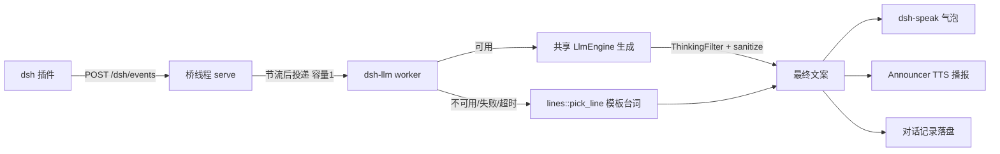

# dsh 事件 LLM 播报方案（LLM 总结 → 聊天气泡 → TTS 自动播报）

> 状态：已评审通过，实施中
> 日期：2026-08-29
> 关联模块：`src/dsh/`、`src-tauri/src/lib.rs`（dsh 桥管线）、`src/llm/`、`src/voice/`

## 1. 现状分析

### 1.1 dsh 桥现状数据流

dsh（deepseek-harness）插件在任务状态翻转瞬间 POST 语义化事件到 ZapMomo 进程内
loopback HTTP 桥（`POST /dsh/events` + Bearer token），管线在
`src-tauri/src/lib.rs` 的 `handle_dsh_event`：

```
dsh 插件 POST /dsh/events → 桥线程 serve() → sink
  ① 节流（EventThrottle，3s 窗口同 (session, kind) 去重）
  ② lines::pick_line → 固定模板台词（lines.rs 注释：「LLM 生成留待后续抽象」）
  ③ emit "dsh-speak"（一次性全文）→ 前端气泡（插播替换语义）
  ④ voice_enabled && voice 会话空闲 && Announcer 可用 → TTS 播报
     （Announcer：enabled 检查 / preflight / 懒构建重试 / 队列容量 1 防重叠）
  ⑤ record_to_history → 落盘对话记录
```

事件本身只有三个薄字段：`title`（任务标题）、`reason`、`detail`（各截断
200 字符），没有任务实质内容。

### 1.2 可复用的基础设施

| 设施 | 位置 | 说明 |
| --- | --- | --- |
| 共享 LLM 引擎 | `LlmState.engine`（Tauri） | GUI 聊天与 voice 会话同一 `Arc<LlmEngine>`；`generate` 异步投递 + `subscribe()` 流式广播；生成互斥（`Busy`） |
| ThinkingFilter | `src/voice/session.rs`（私有） | 流式过滤 `<think>...</think>` 块，标签跨 token 残片安全 |
| TTS 清洗 | `voice::sanitizer::sanitize_for_tts`（pub） | markdown/emoji/fence 剥离，TTS 朗读减负 |
| dsh TTS 播报 | `src/dsh/announce.rs` `Announcer` | 独立 worker 合成 + rodio 播放，队列容量 1，与 voice 会话互斥 |
| 模板台词 | `src/dsh/lines.rs` | 现成降级文案（「开工啦」「冲鸭」陪伴感语气） |

### 1.3 现状问题

dsh 事件播报是固定模板台词，无 LLM 参与；同一事件永远同几句话，无陪伴感与
个性化表述。

## 2. 架构分析

```
dsh 事件到达（桥线程 serve sink，保持同步、不被阻塞）
  ① 节流（不变）
  ② 投递给 dsh-llm worker 线程（覆盖式单槽：忙时新事件替换旧事件）← 新增，桥线程到此结束
  ③ worker：决策走 LLM 还是模板
       条件：cfg.llm_enabled && llm.enabled && 引擎存在 && is_ready && !is_generating
       ├─ 满足 → generate(专用 prompt) → 流式收 Token（ThinkingFilter 过滤 <think>）
       │         → Finished 后拼完整文本 → sanitize_for_tts 清洗
       └─ 任一不满足 / 生成失败 / 超时(15s) → 回退 lines::pick_line 模板台词
  ④ emit "dsh-speak"（协议不变，前端零改动）
  ⑤ voice 空闲 && Announcer 可用 → announce(最终文本)
  ⑥ record_to_history → 落盘最终文本
```



### 2.1 关键设计决策（已与需求方确认）

| 决策点 | 结论 | 理由 |
| --- | --- | --- |
| LLM 输入 | 只用现有薄字段（title/reason/detail） | 零跨端改动，LLM 负责有陪伴感的转述文案；dsh 侧推实质内容留作第二步 |
| 气泡时机 | 等 LLM 完成再出 | 气泡/TTS/落盘三者同一份文案，体验一致、实现最简；代价是气泡晚 1~3 秒 |
| LLM 通道 | 复用共享 `LlmEngine` | 零新增配置与连接管理；与「统一引擎串行」设计哲学一致 |
| 降级策略 | LLM 不可用一律回退模板台词 | 气泡永不缺席是底线（模板路径即现状行为） |

### 2.2 降级矩阵

| 场景 | 行为 |
| --- | --- |
| `[dsh].llm_enabled = false` 或 `[llm].enabled = false` | 模板台词 |
| 引擎未连接 / 未就绪（用户没点「连接」） | 模板台词 |
| voice / GUI 正在生成（`Busy`） | 模板台词（对话优先，不抢引擎） |
| 生成失败 / 15s 超时 / 清洗后为空 | 模板台词 |
| 正常 | LLM 文案 |

## 3. 技术方案

### 3.1 桥线程不等待原则

`handle_dsh_event` 在 `serve` 的 sink 闭包里同步执行；若原地等 LLM（秒级）会
阻塞桥收下一条事件。因此 LLM 等待全部移入独立 worker 线程，桥线程只做节流 +
投递。

### 3.2 worker 线程模型（`DshLlmWorker`）

- 覆盖式单槽（`Mutex<Option<DshEvent>>` + `Condvar`），named thread `dsh-llm`；
  上一条未处理完时新事件**替换**旧事件——最新任务状态最值得播报，避免
  「started 占槽导致 finished 永不出气泡」的丢事件问题
- 引擎每次事件从 `LlmState.engine` 现取（跟随连接/切换，不缓存句柄；引擎被
  换掉后旧 Arc 由 drop 语义自然释放，同 `forward_llm_events` 哲学）
- 超时（15s）以 `recv_timeout` 消费事件流实现 deadline，超时 `engine.cancel()`
  后降级模板
- 单轮生成、不写共享 history：不污染 voice 会话上下文

### 3.3 prompt 设计

- 专用 system prompt：一句话转述事件、纯文本、禁 markdown/emoji（对齐
  `llm/config.rs` 默认 prompt 的 TTS 减负约束）、语气与模板台词一致（陪伴感）
- user 消息由事件字段结构化拼装（字段缺失自动省略）
- `max_tokens` 取小值（120）：气泡与 TTS 都不适合长文

### 3.4 文本处理链

`ThinkingFilter`（提取自 `voice/session.rs` 私有实现，行为不变）流式过滤
`<think>` 块 → 完整文本 `sanitize_for_tts` 清洗 → 气泡 / TTS / 落盘共用同一份
最终文本。清洗后为空视为生成失败 → 降级模板。

### 3.5 配置

`[dsh]` 新增 `llm_enabled: Option<bool>`（缺省 true，与 `voice_enabled` 先例
一致）；生效仍需 `[llm].enabled = true` 且引擎已连接。

## 4. 实施拆分与验收

| 阶段 | 内容 | 验收 |
| --- | --- | --- |
| Step 1a | `ThinkingFilter` 提取为 `voice::thinking`（pub(crate)，行为不变） | 原有测试全部通过 |
| Step 1b | 新增 `src/dsh/narrate.rs`：prompt 拼装、`should_use_llm` 降级决策、输出拼装纯函数 + 单测 | `cargo test` 绿 |
| Step 2a | `[dsh].llm_enabled` 配置项（settings + resolve + 测试） | `cargo test` 绿 |
| Step 2b | `DshLlmWorker` + `handle_dsh_event` 投递化改造（src-tauri） | `cargo clippy -p zapmomo-app -- -D warnings` |
| Step 3 | 全量验收 | `cargo fmt --check && cargo clippy -- -D warnings && cargo test` |

手动验收清单：

1. 连接 LLM 后触发 dsh 事件 → 气泡出 LLM 文案 + TTS 播报同一文本
2. 断开 LLM（或 `[llm].enabled = false`）→ 事件秒回模板台词
3. voice 会话进行中触发 → 模板台词且不打断对话
4. LLM 生成中拔网线 / 超时 → 15s 内降级模板台词

## 5. 与语音会话共存（空档插播）

初版守卫是「voice 会话运行中一律静音」，但语音会话是常驻形态（KWS 待唤醒），
一刀切使 dsh 语音播报在常驻场景下永久失效。改为**空档插播**：

- 宿主在 `make_voice_emit` 的 `VoiceEvent::State` 臂镜像当前 `SessionState`
  到 `VoiceSessionState.phase`（Stop → Idle 由状态机保证闭环）
- `dsh::announce::voice_slot_available`：会话未运行或处于 `Armed`（待唤醒
  空闲）时可插播；`Listening`（插话会被麦克风拾回污染 ASR）、`Speaking`
  （与 TTS 重叠）、`Thinking`/`Greeting`/`WaitingSpeech` 一律等待
- `narrate_event` 的语音段轮询等待空档（200ms 粒度，上限 30s）；超时放弃
  语音（气泡已送达）。气泡不等，事件到达即出
- `Armed` 播报的回声风险已由 barge-in 架构消化：`Speaking` 期间 KWS 本就
  持续监听 TTS 回声，非唤醒词内容不触发
- 已知边界：dsh 开口的几秒窗口内用户喊唤醒词会有一次短暂重叠（低概率，
  后续可加播报中让位）

## 6. 已知边界（记录在案，非本次范围）

- 共享引擎广播：dsh 生成的 token 也会进 `llm-token` 前端事件（用户开着聊天页
  会看到 dsh 流）——与 voice 现状一致，非新增问题；留作「事件加来源标签」优化
- dsh 侧推送实质任务内容（真正「总结任务做了什么」）：桥协议宽容解析天然兼容
  新字段，留作两步走的第二步
