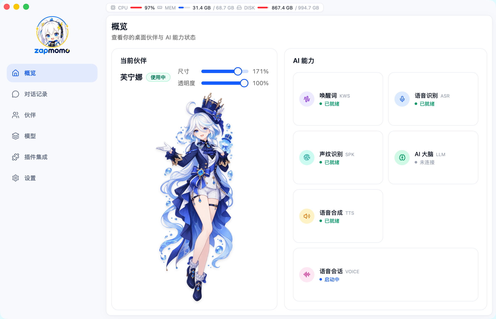

<div align="right">

**简体中文** | [English](README.en.md)

</div>

<div align="center">
  

  <p>
    <a href="https://github.com/shenjingnan/zapmomo/releases"></a>
    <a href="https://crates.io/crates/zapmomo"></a>
    <a href="https://crates.io/crates/zapmomo"></a>
    <a href="https://github.com/shenjingnan/zapmomo/actions/workflows/ci.yml"></a>
    <a href="https://codecov.io/gh/shenjingnan/zapmomo"></a>
    <br />
    <a href="LICENSE"></a>
    <a href="https://www.rust-lang.org/"></a>
    <a href="#应用下载"></a>
    <a href="#应用下载"></a>
    <a href="#应用下载"></a>
  </p>
</div>

An open-source, real-time desktop **AI companion** with voice, memory, and a customizable virtual character.

开源的实时桌面 AI 伴侣：语音交互、记忆能力、可定制的虚拟角色。

<div align="center">
  
</div>

<details>

<summary>✨ 特性一览</summary>

- **语音唤醒（KWS）** — 说唤醒词即可唤醒伙伴；自定义唤醒词直接输中文，自动转拼音，无需任何外部工具
- **语音识别（ASR）** — 中英双语实时转文字幕（流式 Zipformer），自动加标点、支持热词；另有离线 Qwen3-ASR 可选（29 语言自动识别）
- **文本转语音（TTS）** — 中英双语语音合成，内置多音色，支持用参考音频克隆自己的音色
- **本地大语言模型（LLM）** — 基于 llama.cpp 的本地推理（流式对话 + Agent 工具调用），应用内一键下载预设模型；也可接入 OpenAI 兼容远程 API
- **语音会话** — 一句话唤醒 → 语音识别 → 流式回复 → 实时播报，支持唤醒词打断与免唤醒续聊
- **声纹识别（Speaker Recognition）** — 录入声纹后识别「是谁在说话」：基于本地 CAM++ 声纹模型（声音特征而非 ASR 文本），支持多人注册、相似度阈值与 unknown 判定；仅用于区分说话人，**不构成安全认证**
- **Live2D 虚拟角色** — 桌面常驻角色窗口（Cubism 2/3/4/5），位置记忆与百分比缩放，拖动不抢焦点；也支持 GIF 动图与「角色包」（静态立绘 + 人设 + 音色克隆）
- **跨平台桌面应用** — Windows / macOS / Linux 三平台安装包，多页面控制面板 + 常驻角色窗口
- **deepseek-harness 集成** — 桌宠实时感知 [deepseek-harness](https://github.com/deepseek-ai/deepseek-harness) 任务状态，任务开始 / 完成 / 失败 / 中断时以气泡 + 语音播报（[使用说明](docs/content/docs/desktop-app/dsh-bridge.mdx)）
- **本地优先** — 各模型默认全部本地运行，对话数据不出设备

</details>

## 应用下载

点击下方按钮直接下载对应系统的最新版安装包（无需登录 GitHub，自动指向最新 Release）：

| 系统 | 芯片 / 架构 | 立即下载 |
| --- | --- | --- |
| Windows 10 / 11 | x64 | [](https://github.com/shenjingnan/zapmomo/releases/latest/download/ZapMomo_Windows_x64.exe) |
| macOS 13+ | Apple Silicon（M1/M2/M3/M4） | [](https://github.com/shenjingnan/zapmomo/releases/latest/download/ZapMomo_macOS_arm64.dmg) |
| macOS 13+ | Intel | [](https://github.com/shenjingnan/zapmomo/releases/latest/download/ZapMomo_macOS_x64.dmg) |
| Ubuntu / Debian | amd64 | [](https://github.com/shenjingnan/zapmomo/releases/latest/download/ZapMomo_Linux_amd64.deb) |
| Fedora / RHEL | x86_64 | [](https://github.com/shenjingnan/zapmomo/releases/latest/download/ZapMomo_Linux_x86_64.rpm) |

- Windows 企业批量部署可选 [MSI 版](https://github.com/shenjingnan/zapmomo/releases/latest/download/ZapMomo_Windows_x64.msi)；Linux 可选 [AppImage](https://github.com/shenjingnan/zapmomo/releases/latest/download/ZapMomo_Linux_amd64.AppImage) 免安装直接运行。
- 完整版本与更新日志见 [Releases](https://github.com/shenjingnan/zapmomo/releases)。
- 🍎 Mac 不确定芯片？左上角  →「关于本机」：显示「芯片：Apple M…」选 arm64，显示「处理器：Intel…」选 x64。
- 📦 模型不随安装包分发：首次使用在应用「模型」页一键下载（LLM 在「AI 大脑（LLM）配置」页）。

### macOS 首次打开（未签名）

项目未申请 Apple Developer 证书，安装包**未签名**。每次从 Releases 下载后，首次启动都会被系统拦截（提示「无法验证开发者」）。请先将 App 拖入「应用程序」，再执行：

```bash
xattr -cr "/Applications/ZapMomo.app"
```

随后启动即可正常打开。若 App 不在「应用程序」，把命令里的路径换成实际位置；或右键 App →「打开」→ 再次点击「打开」。

<details>

<summary>📖 功能说明（语音会话 / AI 大脑 / Live2D 角色 / 自启动 / 重启）</summary>

### 语音会话

唤醒 → 识别 → 思考 → 播报的完整语音对话链路：

- **唤醒词打断** — 播报/思考期间再次说出唤醒词，立即打断并重新聆听
- **免唤醒续聊** — 回复播完后自动进入聆听，无需重复唤醒
- **可调参数** — 唤醒词、回复音色、语速、欢迎语等可在「设置」页调整

### AI 大脑（LLM）

- **本地运行** — llama.cpp 本地推理，流式对话 + Agent 工具调用，数据不出设备
- **一键下载** — 应用内提供 Qwen3-0.6B / 4B 等预设，点击即下载（推荐 Qwen3-4B-Instruct-2507，Q4_K_M 量化约 2.5GB）
- **自备模型** — 任意 GGUF 模型放入 `~/.zapmomo/models/` 即自动发现
- **远程接入** — 支持配置 OpenAI 兼容 API（官方 API 或自建 `llama-server`）

### Live2D 虚拟角色

常驻桌面角色窗口：呼吸、眨眼等自动动画，与控制面板分离、独立悬浮。

- **拖动不抢焦点** — 按住左键移动角色，不干扰其他应用；macOS 上从 Dock / Cmd+Tab 隐形
- **位置记忆 + 百分比缩放** — 关闭后自动记住位置；缩放 25% ~ 200%（`cmd/ctrl + 滚轮`、右键菜单、设置页均可调节）
- **动作与表情** — 「伙伴」页可预览并切换模型的动作 / 表情
- **格式** — 支持 Cubism 2 / 3 / 4 / 5（`.model3.json` / `model.json`）
- **模型来源** — 自备 Live2D 模型目录，在「伙伴」页导入；默认目录 `~/.zapmomo/models/live2d`
- **GIF 动图** — 「伙伴」页可直接导入 `.gif` 文件作为桌面伙伴
- **角色包** — 「伙伴」页导入角色包目录（`character.md` 人设 + `character.png` 静态立绘，可选 `voice/reference.wav` + `voice/reference.txt` 音色克隆参考）：设为当前使用后，人设自动覆盖全局 system prompt，支持克隆的 TTS 模型（ZipVoice / OmniVoice）自动使用角色音色；切回其他伙伴自动恢复全局配置

### 开机自启动

设置页「通用」与托盘菜单均提供「开机自启动」：登录系统后自动启动 ZapMomo，桌宠静默出现（设置窗口不自动弹出）。注册的是系统级启动项（macOS 登录项 / Windows 启动应用 / Linux autostart），也可在系统设置中统一管理；重复启动时会激活已有实例，不会出现两个桌宠。

### 一键重启

设置页「通用」、角色右键菜单与托盘菜单均提供「重启」：退出后自动重新拉起，用于让需要重启才能生效的配置立即生效。

</details>

## deepseek-harness 集成（dsh 桥）

桌宠实时感知 [deepseek-harness](https://github.com/deepseek-ai/deepseek-harness)（dsh）任务状态：任务开始 / 完成 / 失败 / 中断时，Live2D 角色以文字气泡 + 语音播报。接入一条命令：

```bash
dsh plugin --profile web add @zapmomo-ai/dsh-plugin
```

装完重启 `dsh web` 即生效（设置页「外部感知 · dsh 桥」默认启用）。详见[文档站](docs/content/docs/desktop-app/dsh-bridge.mdx)。

<details>

<summary>⚙️ 高级配置（`~/.zapmomo/settings.toml` 配置段一览）</summary>

桌面应用的配置存储在 `~/.zapmomo/settings.toml`（TOML 格式），常用设置（麦克风设备、TTS 音色、语音会话参数等）均可在应用「设置」页内调整；以下配置段也可直接编辑文件覆盖默认值（支持 `${env.VAR}` 环境变量引用）：

| 配置段 | 用途 |
|--------|------|
| `[kws]` | 唤醒词检测：触发阈值、推理线程数、自定义关键词文件等 |
| `[asr]` | 语音识别：热词、断句静音阈值、标点开关等 |
| `[tts]` | 文本转语音：默认音色参考音频、语速、解码步数等 |
| `[llm]` | 大语言模型：模型路径、采样参数、OpenAI 兼容远程 API 等 |
| `[voice]` | 语音会话：唤醒词、回复音色、打断与免唤醒续聊开关等 |
| `[speaker]` | 声纹识别：enabled 开关（启用即仅响应已注册说话人）、相似度阈值等 |
| `[live2d]` | Live2D 角色：模型目录、窗口位置记忆与缩放 |
| `[dsh]` | deepseek-harness 集成：桥开关、监听端口、语音播报与对话记录开关 |

完整配置项与 CLI 命令参考见[贡献指南](CONTRIBUTING.md)。

</details>

## 参与开发

- [贡献指南](CONTRIBUTING.md)：环境搭建、CLI 命令与完整配置参考、测试、项目结构与发布流程
- [文档站](docs/)：「贡献指南」与「开发指南」分区

## 许可

[GPL-3.0](LICENSE)
