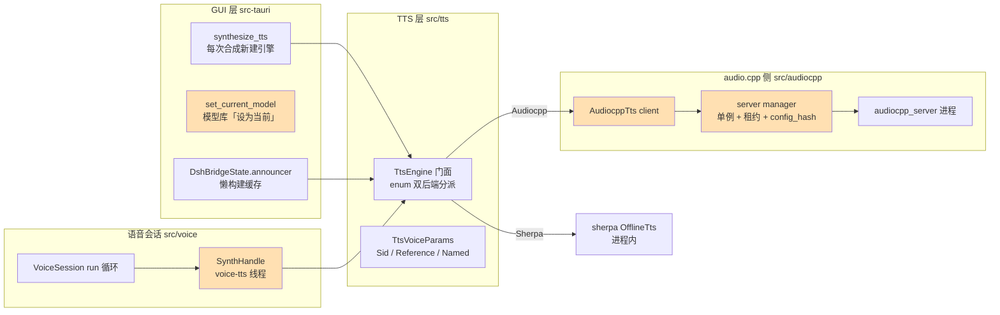
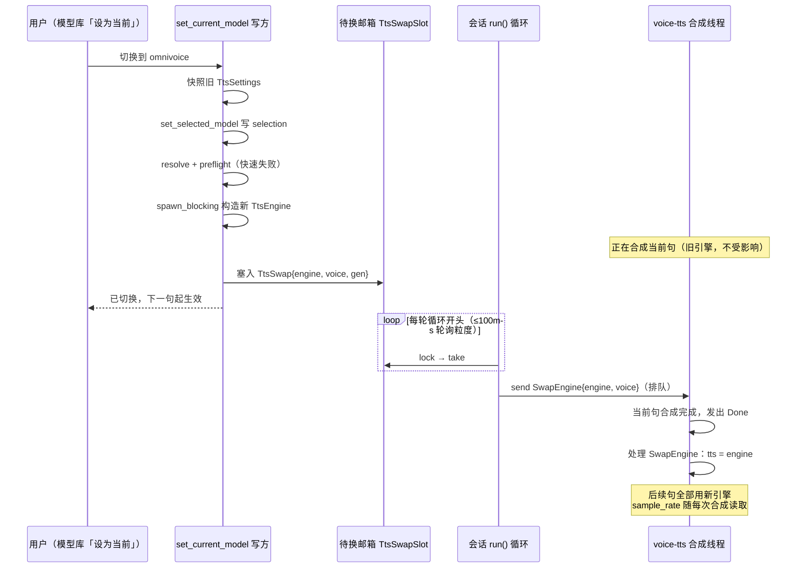

# ZapMomo TTS 全模型热切换与 OmniVoice 接入技术方案

| 项 | 内容 |
| --- | --- |
| 文档版本 | v1.1 |
| 日期 | 2026-08-23 |
| 状态 | 已实施（阶段 1-4 完成，GUI 手动验收待用户执行） |
| 范围 | TTS 模型无缝切换体系 + audio.cpp omnivoice 模型族接入 |
| 上游依赖 | [0xShug0/audio.cpp](https://github.com/0xShug0/audio.cpp) @ `release-0.6.1`（锁定） |

> **实施结果（2026-08-23，同日完成阶段 1-4）**：阶段 1 实测数据见 §5 阶段 1 附表；
> 阶段 2-4 代码全部落地——`families.rs` 描述表 / preflight·server_config·client 族泛化 /
> `resolve_voice_params` 四处收敛 / server manager 多实例（`HashMap<config_hash, _>` +
> `config_hash` 含 model_type + 按代际 pidfile）/ `SwapEngine` 命令 + 每句读采样率 /
> `TtsSwap` 邮箱 + `set_current_model` TTS 事务臂（失败整表回滚）/ dsh Announcer 失效钩子。
> 验证：根 crate 666 单测 + 集成 6 + app 20 + 前端 416 全绿，clippy `-D warnings` 通过，
> 真实引擎 E2E（auto RTF 0.46 / clone RTF 1.05，Metal）。额外落地：registry 新增
> `platforms` 字段（平台过滤，omnivoice 仅 darwin-aarch64）。README 无模型表、
> CHANGELOG 由 release-plz 自动生成，无需手改。**剩余手动验收清单**（需 GUI + 麦克风 +
> 人耳，见 §5 阶段 4）：模型库下载 omnivoice → 设为当前 → 语音会话 Speaking 中
> zipvoice↔omnivoice↔pocket 三组合句间切换听感验证。

---

## 1. 背景与目标

### 1.1 需求背景

ZapMomo 的 TTS 已实现双后端架构（sherpa-onnx 进程内推理 + audio.cpp sidecar HTTP 推理），并在模型库中并行提供多个 TTS 模型。当前存在两类问题：

1. **切换不彻底**：语音会话（KWS→ASR→LLM→TTS 全链路）的 TTS 引擎在会话构造时创建并移入合成线程，会话运行期间无法触达。用户在会话运行中切换 TTS 模型，`set_current_model` 返回 `effective_immediately: true`，但会话实际继续使用旧引擎直到会话重启——返回语义与真实行为不符（下文称「假即时」）。
2. **audio.cpp 侧单模型硬编码**：模型族常量、完整性预检、server 配置生成、HTTP 客户端请求体全部硬编码 `pocket_tts`，无法接入具备中文合成与音色克隆能力的模型族。

用户目标：任何 TTS 模型（sherpa 侧 6 个模型族 + audio.cpp 侧 pocket/omnivoice）在应用内切换后**立刻生效、无需重启应用**；语音会话运行中切换采用**句间热切换**（零中断、不丢会话历史）。

### 1.2 目标与非目标

**目标（本期）**：

- G1：接入 audio.cpp `omnivoice` 模型族（中文 + 零样本声音克隆 + 声音设计，Qwen3-0.6B 基座），走模型库「下载 → 设为当前 → 合成」既有链路
- G2：TTS 切换在三条消费路径上均真实即时生效——GUI 合成页（现状已达成，保持）、语音会话（新增句间热切换）、dsh 播报（缓存失效钩子）
- G3：audiocpp server 进程管理支持多配置实例共存，消除切换时的进程互斥
- G4：为 SSE 流式合成与后续模型族（voxcpm2 等）预留结构化扩展点

**非目标（本期不做，仅预留）**：

- SSE 流式合成（`stream_format:"sse"` 音频分块返回）——`ServerModelConfig.mode` 字段与请求体设计预留，不实现消费端
- voxcpm2 / confucius4_tts / dots_tts 等其它 audio.cpp 模型族
- omnivoice 声音设计（instruct 描述音色）的 UI 入口（上游 HTTP API 未文档化该传参，待二期探明）
- server 端 `voice_dir` 音色库分发机制

### 1.3 范围决策记录

| 决策点 | 结论 | 依据 |
| --- | --- | --- |
| 一期接入模型 | omnivoice（仅 q8_0） | 中文+克隆+声音设计全支持；体积/能力均衡；voxcpm2（2B）与 confucius4（仅 F32）体积过大，dots_tts 上游标注 experimental |
| 流式合成 | 不纳入，仅预留 | 流式需 client SSE 消费 + 会话播放编排改造，独立立项 |
| 会话内切换 | 句间热切换 | 整会话重启会中断唤醒/识别数秒且丢失会话历史，不符合「无缝」目标 |

---

## 2. 现状分析

### 2.1 TTS 双后端架构现状

引擎门面 `TtsEngine`（`src/tts/mod.rs:162-172`）按 `ResolvedTtsConfig.backend` 分派：

- **sherpa-onnx**：进程内 `OfflineTts`，支持 zipvoice/vits/matcha/kokoro/kitten 等模型族；
- **audio.cpp**：`AudiocppTts`（`src/audiocpp/client.rs`）持有 sidecar 进程租约，经 HTTP `POST /v1/audio/speech` 合成。

音色参数统一为 `TtsVoiceParams` 三变体（`src/tts/mod.rs:32-42`）：`Sid`（固定说话人）、`Reference`（参考音频克隆）、`Named`（具名音色）。

### 2.2 三条 TTS 消费路径的切换现状

| 路径 | 引擎生命周期 | 切换后生效方式 | 现状评价 |
| --- | --- | --- | --- |
| GUI 合成/试听页 | 每次合成新建（`synthesize_tts` → `synthesize_inner`，`src-tauri/src/lib.rs:1250,1140`） | 下一次合成自然用新配置 | ✅ 已即时 |
| 语音会话 VoiceSession | 会话构造时创建，按值 move 进合成线程（`src/voice/session.rs:148,172`） | **不生效**，直到会话重启 | ❌ 假即时 |
| dsh 播报 Announcer | 懒构建后缓存（`DshBridgeState.announcer`，`src-tauri/src/lib.rs:2131`） | **不生效**，直到 dsh 桥重启（`:2279` 仅桥 start 时清缓存） | ❌ 陈旧缓存 |

「假即时」的具体表现：`set_current_model` 对非 LLM 模型只写 selection（`src-tauri/src/lib.rs:4663-4703`），TTS 落入 `_` 分支返回 `LibRuntimeAction::None` + `effective_immediately: true`。前端注释（`useTtsModelSwitch.ts:78-79`「TTS 切换不需要重启任何 runtime」）与语音会话的真实行为不一致。

### 2.3 问题清单

| # | 问题 | 位置 | 影响 |
| --- | --- | --- | --- |
| P1 | 会话 TTS 引擎无法热替换 | `src/voice/synthesizer.rs:18-21`（命令枚举仅 Synthesize/Shutdown） | 会话中切换假即时 |
| P2 | 合成线程 `sample_rate` 一次性捕获 | `src/voice/synthesizer.rs:51` | audiocpp 首响应校准采样率后无法传回播放侧；采样率 ≠24kHz 的模型族是真缺陷（pocket 恰为 24kHz 未暴露） |
| P3 | audiocpp 侧写死 pocket 单模型 | `src/audiocpp/mod.rs:18-26` 常量、`src/tts/config.rs:310-313,347-350` preflight、`src/audiocpp/server_config.rs:38-58`、`src/audiocpp/client.rs:66-110` | 无法接入新模型族 |
| P4 | client 拒绝参考音频克隆 | `src/audiocpp/client.rs:76-81` | 上游 `/v1/audio/speech` 已支持 `voice_ref`+`reference_text`，客户端未映射 |
| P5 | audiocpp server 单实例互斥 | `src/audiocpp/server.rs:100-116`（config_hash 变更先杀后 spawn） | 切换瞬间杀死正在合成当前句的 server；GUI 合成页以不同配置合成同样会杀掉会话的 server（既有 bug，热切换会放大） |
| P6 | dsh Announcer 缓存不失效 | `src-tauri/src/lib.rs:2131,2279` | 切换后播报沿用旧模型 |
| P7 | `uses_reference_audio()` 对 audiocpp 恒 false | `src/tts/config.rs:302-304` | omnivoice 克隆语义需要族感知 |

### 2.4 上游能力核实结论（audio.cpp release-0.6.1）

以下均已核实（`app/server/README.md`、`docs/models/omnivoice.md`、`model_specs/omnivoice.json`）：

- family 名为 `omnivoice`（无下划线）；tasks: tts/clone/design；modes: offline+streaming；输出 24 kHz
- 模型资产为**单文件 GGUF**（generator 与 audio_tokenizer 双权重内嵌，无 embeddings 副件）：`OmniVoice-GGUF/omnivoice-q8_0.gguf`，**1,350,288,416 字节 ≈ 1.26 GiB**（HF content-length 实测），sha256（HF LFS oid）`2f4be637278043c6842de5b85d681532030e9eb6ffe0f8b0e320f68238e3da8b`
- 克隆 API：请求体 `voice_ref`（服务器路径串或 `{type:"base64",data}` ≤5MiB）+ `reference_text`；`voice` 字段可匹配 server 端 preset / voice_dir 音色库 / 原生 cached voice id（解析优先级：voice_ref > preset > voice_dir > 原生）
- 无必填 `load_options`（language 自动检测）
- 上游仅公布 CUDA RTF（one-shot 0.146）；**CPU/Metal RTF 无官方数字——本方案最高风险项，阶段 1 实测拦截**

---

## 3. 当前架构分析

### 3.1 模块架构与改造点



橙色节点为本方案改造点：`set_current_model`（写方事务化）、`SynthHandle`（SwapEngine 命令）、server manager（多实例）、client（族泛化）。

### 3.2 会话 TTS 链路与所有权

`VoiceSession::new_with_parts`（`src/voice/session.rs:124-210`）中，KWS/ASR/TTS/麦克风/扬声器全部构造时新建；**唯一例外是 LLM**——通过共享槽 `llm_slot: Arc<Mutex<Option<Arc<LlmEngine>>>>` 注入（`:134-146`）。

`SynthHandle`（`src/voice/synthesizer.rs`）：单一 `voice-tts` 后台线程，mpsc 命令通道（`SynthCommand::{Synthesize, Shutdown}`）+ 结果通道（`SynthResult::{Done{gen_id,samples,sample_rate}, Error}`）。TtsEngine 按值 move 进线程闭包后，会话再也无法触及引擎实例。播放在编排线程的 speaker（rodio）完成，按句携带 sample_rate 自适应（`src/voice/session.rs:596`）。

### 3.3 LLM 每轮重绑定先例与 TTS 的关键差异

LLM 热切换已实现：写方 `set_current_model` LLM 事务（`src-tauri/src/lib.rs:4746-4759`，`spawn_blocking` 加载 + replace 槽 + 失败回滚）；读方 `refresh_llm_if_switched`（`src/voice/session.rs:274-295`）在 `run()` 每轮循环开头 lock 槽 → clone Arc → `ptr_eq` 比较 → 不同则替换。

**TTS 不能照抄**，两个硬约束：

1. `TtsEngine` 仅保证 `Send`（`src/tts/mod.rs:159`；sherpa `OfflineTts` 无 `Sync` 保证），不能以 `Arc<TtsEngine>` 跨线程共享克隆；
2. TTS 引擎必须**在合成线程内**按值持有替换，而非编排线程重绑定。

因此本方案采用「**待换邮箱（所有权转移）+ SwapEngine 命令**」设计（见 §4.5）。

### 3.4 sidecar 进程管理现状

`src/audiocpp/server.rs`：进程级单例（`MANAGER: OnceLock<Mutex<ManagerState>>`）+ 租约计数。`lease()` 复用判定：实例存活且 `config_hash` 一致才复用，否则先杀旧实例再 spawn 新实例（`:100-116`）。GUI 侧 45s 空闲 keepalive 复用热 server（热请求 0.13s 级，冷启动 spawn+加载 1~3s）。

### 3.5 模型注册 / 下载 / 发布链路

- registry 条目（`models/model_registry.json`）→ `RegistryModel`（`src/model_library/registry.rs:55-96`）；`tts_kind` 反序列化直传 `TtsModelKind`
- manifest 资产（`models/manifest.json`）编译期嵌入；`kind:"raw"` 单文件下载（archive 字段 = 安装目录内相对路径），`kind:"archive"` 解压安装
- 下载安装：`install_managed_model` staging → 校验 → 原子 rename（`src/model_library/mod.rs:1167-1339`），支持进度/取消
- 切换：`set_selected_model(ModelType::Tts, path)`（`mod.rs:407-454`）按目录 basename 反查 registry → 权威写 `model_dir`/`model_type`/`backend`（`runtime == "audiocpp"` 判定已通用）/跨族清 `voice`
- 完整性：探测式 `is_installed`（`mod.rs:688-851`）+ `required_files_for_role` role→文件清单映射（`registry.rs:142-176`）
- sidecar 编译：`AUDIOCPP_MODELS=pocket_tts` 出现于 `.github/workflows/release.yml:156`（四平台矩阵）与 `scripts/fetch-audiocpp-dev.sh` 两处；`AUDIOCPP_DEPLOYMENT_BUILD=ON` 内嵌 model specs；externalBin 单二进制 `binaries/audiocpp_server-<triple>`

---

## 4. 技术方案

### 4.1 设计决策总表

| # | 决策 | 理由 |
| --- | --- | --- |
| D1 | `TtsModelKind` 加 `Omnivoice` 变体（沿 Pocket 先例） | Pocket 已验证「audiocpp-only kind」全链路可行；单字段贯穿约 12 个消费点，独立 family 字段会引入二维组合空间且类型系统拦不住非法组合 |
| D2 | 新建 `families.rs` 模型族静态描述表，删除散落常量 | 单一事实源；新增模型族从改 6 处硬编码降为「表一行 + registry/manifest 各一条 + 前端 preset 一条」 |
| D3 | 克隆参考随请求传（`voice_ref`），不进 server config | 换音色不重启 server，复用热进程；与 zipvoice 克隆数据流同构 |
| D4 | 热切换 = 待换邮箱 + `SwapEngine` 命令 | 适配 TtsEngine 仅 Send 的约束；mpsc 队列天然给出句间零中断语义 |
| D5 | server manager 多实例共存 | 消除 audiocpp↔audiocpp 切换时杀正在合成进程的冲突；顺带修复 P5 既有 bug |
| D6 | 一期仅 omnivoice q8_0 | 体积 1.26 GiB 已是现有最大 TTS 资产 pocket（122 MB）的约 10.5 倍；f16 更大更慢不引入 |

### 4.2 配置层泛化（D1）

- `TtsModelKind`（`src/tts/config.rs:85-97`）加 `Omnivoice`；`as_str`/`parse_str`（`:99-126`）加 `"omnivoice"` 映射
- `TtsModelKind::uses_reference_audio()` 扩为 `matches!(self, Zipvoice | Omnivoice)`
- `ResolvedTtsConfig::uses_reference_audio()`（`:302-304`）改为按 backend 分派（**保留 backend 条件**，防「audiocpp 后端 + 目录探测误判 Zipvoice」的老场景走 Reference 路径）：

```rust
pub fn uses_reference_audio(&self) -> bool {
    match self.backend {
        TtsBackendKind::Sherpa => self.model_type.uses_reference_audio(),
        TtsBackendKind::Audiocpp => self.model_type == TtsModelKind::Omnivoice,
    }
}
```

- `resolve()` 不加 Omnivoice 臂（audiocpp 路径不消费 sherpa 文件字段，`_ => {}` 已覆盖，加注释说明）；`detect_kind_from_dir` 不加 gguf 探针（模型族由 `set_selected_model` 权威写入，与 pocket 现状一致）
- 既有测试 `test_uses_reference_audio_backend_aware`（`config.rs:1136-1150`）锚点更新：audiocpp+omnivoice=true 为新行为

### 4.3 audiocpp 模型族描述表（D2）

新建 `src/audiocpp/families.rs`：

```rust
/// audiocpp 模型族静态描述。新增族 = 加一行 + registry/manifest/前端各一条。
pub struct AudiocppFamilyDesc {
    pub model_id: &'static str,                    // server config models[].id 与请求体 model（同源）
    pub family: &'static str,                      // audio.cpp model_specs family 名
    pub gguf_file: &'static str,                   // 主 GGUF（相对模型目录）
    pub required_files: &'static [&'static str],   // preflight 完整性清单
    pub sample_rate: i32,                          // 采样率初值（首响应 wav 头校准）
    pub voice_semantics: VoiceSemantics,
    pub load_options: serde_json::Value,
    pub registry_hint: &'static str,               // preflight 错误提示的 install 命令
}

pub enum VoiceSemantics {
    /// 固定具名音色（pocket：alba；Sid→默认，Reference→UnsupportedVoice）
    FixedNamed(&'static str),
    /// 参考音频克隆（omnivoice：Reference→voice_ref+reference_text；Named→透传；Sid→省略 voice）
    ReferenceClone,
}

pub fn family_desc(kind: TtsModelKind) -> Option<&'static AudiocppFamilyDesc>;
```

两条记录：

| 字段 | pocket（现状迁入，行为零变化） | omnivoice（新增） |
| --- | --- | --- |
| model_id | `pocket-tts-english` | `omnivoice` |
| family | `pocket_tts` | `omnivoice` |
| gguf_file | `pocket-tts-english-q8_0.gguf` | `omnivoice-q8_0.gguf` |
| required_files | 主 GGUF + `embeddings/alba.safetensors` | `omnivoice-q8_0.gguf`（单文件） |
| sample_rate | 24000 | 24000 |
| voice_semantics | `FixedNamed("alba")` | `ReferenceClone` |
| load_options | `{"language":"english"}` | `{}`（language 自动） |

`src/audiocpp/mod.rs:18-26` 旧常量**直接删除**、全部消费点改走表（编译器逼出遗漏，避免「表 + 常量」双源漂移）。

### 4.4 preflight / server_config / client 泛化

- **preflight**（`src/tts/config.rs:347-350` audiocpp 分支）：查 `family_desc(cfg.model_type)`——`Some` 用 `desc.required_files` + `desc.registry_hint`（提示语不再硬编码 pocket registry id）；`None`（sherpa kind 配 audiocpp 后端的非法组合）明确报「模型类型 X 不支持 audiocpp 后端」
- **server_config**（`src/audiocpp/server_config.rs:38-58`）：`build_server_config` 查表生成 `models[]`（id/family/path=`model_dir.join(gguf_file)`/mode/load_options）；返回 `Result`（非法组合报错）。**mode 字段即流式二期扩展点**（`AudiocppFamilyDesc` 后续加 `supports_streaming: bool` 即可，schema 不破坏）；快照单测锁两族
- **client**（`src/audiocpp/client.rs`）：
  - 请求体 `model` 字段与采样率初值查表（`AudiocppTts` 已持有 cfg）
  - voice 映射按族（`:72-82` 改造）——omnivoice：`Reference{wav_path, reference_text}` → `{"voice_ref": "<绝对路径>", "reference_text": "..."}`（客户端与 sidecar 同机，路径串即可，无需 base64）；`Named(v)` → `"voice": v`（二期 preset/音色库通道）；`Sid(_)` → 不发 voice 字段（走 server 默认）。pocket 三态现状不变
  - 错误文案族感知（「暂不支持克隆」仅 pocket 路径保留）

### 4.5 句间热切换机制（核心，D4）

三层结构，写方 → 邮箱 → 会话 → 合成线程：



**A. 待换邮箱**：

```rust
pub struct TtsSwap {
    pub engine: TtsEngine,
    pub voice: TtsVoiceParams,
    pub gen: u64,          // 写方代际，连续切换防旧覆盖新 + 日志
}
pub type TtsSwapSlot = Arc<Mutex<Option<TtsSwap>>>;
```

登记模式与 `barge_in` 同款：会话线程创建 session 前写入 `VoiceSessionState`（`src-tauri/src/lib.rs:1897-1900` 模式），会话退出时清空。写方覆盖策略：`*slot = Some(new)`，旧 pending 引擎 drop（audiocpp 租约释放 / sherpa 内存释放）。CLI `voice run` 不接邮箱（None，与 llm_slot=None 同语义）。

**B. `SynthCommand::SwapEngine{engine, voice}`**（`src/voice/synthesizer.rs:18-21` 扩展）：线程闭包三处改动——`tts`/`voice` 改可变绑定；**`sample_rate` 从 spawn 前一次性捕获改为每次 Synthesize 处理后读 `tts.sample_rate()` 填 Done**（顺带修复 P2：采样率 ≠24kHz 的族当前是真缺陷）；SwapEngine 臂做字段替换。mpsc 单消费者队列天然给出「当前句完成 → 处理 Swap → 后续句新引擎」的句间零中断语义，**不做激进 cancel**（违反零中断目标）。

**C. 会话每轮感知**：`refresh_tts_if_switched`（`src/voice/session.rs` run() 循环开头 `:241-247`，紧邻 `refresh_llm_if_switched`）lock → take → `synth.swap_engine(...)`（`SynthHandle` 新增非阻塞 send 方法；mpsc 无界不会满）。Speaking 状态下编排循环仍按既有轮询粒度运转，swap 排在 pending Synthesize 之后，句间生效。

**D. 写方事务**（`set_current_model` TTS 专属臂，重构 `src-tauri/src/lib.rs:4663-4703` 的 `_` 分支）：

1. 快照旧 `[tts]` 整表（TtsSettings clone）
2. `set_selected_model(Tts, path)`（通用逻辑零改动）
3. resolve 新 cfg + preflight（快速失败，不浪费引擎构造）
4. 会话 running：`spawn_blocking { TtsEngine::new + resolve_voice_params }`（对齐 LLM 事务 `:4754-4759` 先例）→ 成功塞邮箱 → 返回「已切换，下一句起生效」；**失败整表回滚**（`restore_selected_model` 现仅恢复 model_dir，需扩展为整表恢复）→ 会话无感知继续旧引擎
5. 会话未运行：只写 selection（现状语义）
6. 无论 running 与否：清 `DshBridgeState.announcer` 缓存（P6）

**E. 音色解析收敛**：`session.rs:152-171` / `announce.rs:53-65` / 写方第 4 步三处同构逻辑提取到 `src/tts/voice.rs::resolve_voice_params(cfg, voice_id)`。omnivoice 参考音频**复用 voice_store 克隆音色库**（zipvoice 已有的「克隆音色管理」UI 与 wav+转写存储直接同库消费），一次录音两个模型族可用，零新增存储。

### 4.6 server manager 多实例共存（D5）

`src/audiocpp/server.rs` 单文件改造（约 80 行 + 测试适配）：

```rust
struct ManagerState {
    instances: HashMap<u64 /*config_hash*/, InstanceEntry>,  // 原单实例 Option
    // InstanceEntry { inst: ServerInstance, leases: usize }
}
```

- `lease()`：按 hash 查找或 spawn，不再先杀旧实例
- `release`：按 (hash, generation) 减计数，归零走既有 keepalive/reap 线程
- `config_hash` 输入**加 `cfg.model_type`**（model_dir 已隐含区分，显式加入防 external 目录边角 + 自我文档化「模型族变更必换实例」；存量用户 hash 变化一次，一次无害重启）
- **voice / mode 不进 hash**：音色随请求传（D3），换音色复用热实例
- 代价：切换窗口两实例并存（pocket 122MB + omnivoice 1.26GiB 内存映射峰值 ≈1.4GB 额外，keepalive 45s 内旧实例退出回落）

收益对照（热切换组合矩阵）：

| 切换组合 | 单实例（现状） | 多实例（本方案） |
| --- | --- | --- |
| sherpa ↔ sherpa | 无冲突（进程内） | 无冲突 |
| sherpa → audiocpp | spawn 新，不杀对方 | 同左 |
| **audiocpp → audiocpp** | **杀旧 spawn 新，在途请求失败** | **两实例并存，零中断** |
| audiocpp → sherpa | 旧实例 keepalive 后退出 | 同左 |

### 4.7 模型资产与 registry / manifest

**manifest.json 追加**（`models/manifest.json` assets[]，照抄 pocket 两条目模式）：

```json
{
  "name": "omnivoice-audiocpp",
  "role": "tts-audiocpp-omnivoice",
  "version": "q8_0",
  "kind": "raw",
  "archive": "omnivoice-q8_0.gguf",
  "source": "https://huggingface.co/audio-cpp/audio.cpp-gguf/resolve/main/OmniVoice-GGUF/omnivoice-q8_0.gguf",
  "sha256": "2f4be637278043c6842de5b85d681532030e9eb6ffe0f8b0e320f68238e3da8b",
  "size_bytes": 1350288416,
  "license": "Apache-2.0"
}
```

license 以 HF 页面实际标注为准（阶段 1 复核），并同步 `models/THIRD_PARTY_NOTICES.md`。

**model_registry.json 追加**：

```json
{
  "id": "tts-omnivoice-q8-audiocpp",
  "name": "omnivoice-audiocpp",
  "display_name": "OmniVoice 多语种克隆 (audio.cpp)",
  "model_type": "tts",
  "tts_kind": "omnivoice",
  "runtime": "audiocpp",
  "format": "GGUF",
  "description": "OmniVoice（Qwen3-0.6B 基座）零样本声音克隆 + 声音设计，600+ 语种，q8_0 量化，24kHz；由 audio.cpp 引擎驱动。体积约 1.26 GiB，建议 8GB 以上内存设备使用。",
  "languages": ["zh", "en"],
  "tags": ["tts", "audiocpp", "clone", "multilingual"],
  "parameter_count": "0.6B",
  "quantization": "q8_0",
  "version": "q8_0",
  "size_bytes": 1350288416,
  "homepage": "https://huggingface.co/k2-fsa/OmniVoice",
  "required_assets": ["tts-audiocpp-omnivoice"],
  "optional_assets": [],
  "download": { "manifest_role": "tts-audiocpp-omnivoice", "extra_roles": [], "kind": "raw" }
}
```

注意：`name` 是安装目录 basename，也是 `set_selected_model` 反查 registry 的依据，须全局唯一。

**Rust 侧连带**：`required_files_for_role`（`src/model_library/registry.rs:142-176`）加 `"tts-audiocpp-omnivoice" => &["omnivoice-q8_0.gguf"]`；registry 计数断言 30→31（`registry.rs:195-199`）；`test_set_selected_tts_persists_backend_from_registry_runtime`（`mod.rs:1631-1658`）新增 omnivoice 断言用例。`set_selected_model` / `install_managed_model` 本身零改动。

### 4.8 sidecar 编译

两处同步：`.github/workflows/release.yml:156` 与 `scripts/fetch-audiocpp-dev.sh` 的 `AUDIOCPP_MODELS=pocket_tts` → `pocket_tts,omnivoice`。`AUDIOCPP_REF` 维持 `release-0.6.1`（已核实含 omnivoice 支持）。

体积预估：单族裁剪现状约 11MB；新增一族主要是 spec/glue 代码（ggml kernel 复用，DEPLOYMENT_BUILD 只内嵌 spec 描述不含权重），预估 **+2~5MB/平台**，四平台矩阵合计 ≤20MB 分发增量。阶段 1 实测确认。`ci.yml` 空占位校验与 `tauri.conf.json` externalBin 单二进制名均不受影响。

### 4.9 前端改动

| 文件 | 改动 |
| --- | --- |
| `frontend/src/hooks/useTtsModelSwitch.ts:8-57` | `TTS_PRESETS` 追加 omnivoice 条目（id 对齐 registry） |
| `frontend/src/components/tts/ttsMeta.ts:38-53` | `ttsModelKindLabel` 加 `"omnivoice"` 文案 |
| `frontend/src/components/tts/TtsBasicConfig.tsx:147-206` | 音色行由三态扩四态：omnivoice 复用 zipvoice 克隆音色管理（判定条件 `kind === "zipvoice" \|\| kind === "omnivoice"`，voice_store 同库）；pocket/omnivoice 按 kind 字符串区分（现按后端判定的分支需调整） |
| `TtsModelDialog` / `TtsPage.test.tsx` | 快照同步 |

切换 toast 文案由后端 message 驱动（「已切换，下一句起生效」），前端无需特判。

### 4.10 扩展点预留汇总

| 扩展点 | 预留方式 |
| --- | --- |
| SSE 流式 | `ServerModelConfig.mode` 字段 + `AudiocppFamilyDesc` 后续加 `supports_streaming`；client 请求体结构不变（`stream_format` 二期加） |
| voxcpm2 等新族 | families.rs 加一行 + registry/manifest 各一条 + 前端 preset 一条 |
| server 端音色库（voice_dir） | client `Named` 音色已透传 `voice` 字段，天然兼容 |
| 声音设计 instruct | 上游 HTTP 传参方式待文档化，不占本期结构 |

---

## 5. 分阶段实施方案

每阶段独立可验收、可单独合入。阶段 1 为后续阶段的**前置门槛**（RTF 不达标触发 §7-R1 预案后再继续）。

### 阶段 1：资产探明 + sidecar 重编实测

| 项 | 内容 |
| --- | --- |
| 任务 | ① `curl -L + shasum -a 256` 复核 omnivoice-q8_0.gguf；② `AUDIOCPP_MODELS=pocket_tts,omnivoice scripts/fetch-audiocpp-dev.sh --build` 重编，记录体积/编译时长；③ 手写 server config + curl 冒烟：`/v1/audio/speech` 中文合成 + `voice_ref` 克隆参考 wav，验证 24kHz wav 输出与克隆效果；④ CPU RTF 实测（macOS arm64 + Linux x86_64 若可） |
| 涉及文件 | `scripts/fetch-audiocpp-dev.sh` |
| 验收 | 产物体积增量 ≤5MB 记录在案；冒烟 wav 可播且克隆生效；**RTF ≤ 0.8**（合成耗时 / 音频时长，不达标触发 R1 预案） |

**阶段 1 实测结果（2026-08-23，macOS arm64 / Apple Silicon）**：

| 项 | 结果 | 判定 |
| --- | --- | --- |
| sha256 复核 | `2f4be637...38e3da8b` 与 HF LFS oid 一致；1,350,288,416 B | ✅ |
| sidecar 重编 | 12MB（pocket 单族 11MB → 双族 12MB，+1MB），编译约 2.5 分钟，Metal 后端正常编入 | ✅ 远低于 ≤5MB 门槛 |
| server eager 加载 | 约 5s（q8 mmap） | ✅ |
| 中文 auto voice（6.84s 音频） | CPU(4线程)：冷 52.2s / 热 45.2s（RTF 7.6 / 6.6）；**Metal：冷 3.83s / 热 2.83s（RTF 0.56 / 0.41）** | ⚠️→✅ |
| voice_ref 克隆（leijun-1.wav 参考，7.84s 音频） | Metal 8.45s（RTF 1.08，克隆首请求含参考编码编译；热请求更快），wav 输出正常 | ✅ |

**R1 预案落实决策**：

1. **omnivoice 的默认 provider 为 `metal`**（families.rs 描述表新增 `default_provider` 字段：pocket→`cpu`、omnivoice→`metal`）。`server_config.rs:15`「实测小模型 CPU 快于 Metal」的结论仅适用 pocket 100M；0.6B 扩散模型 CPU RTF 6.6 不可用，Metal RTF 0.41（实时率 2.4x）达标。
2. **发布平台矩阵影响**：当前 release.yml 四平台 sidecar 中仅 macOS arm64 编入 Metal；Windows/Linux 产物为纯 CPU（RTF 6.6 不可用）。落实预案 (a)：**omnivoice registry 条目仅在 macOS arm64 平台放开显示/下载**（按平台过滤，阶段 3 实施）。

### 阶段 2：配置层 + server_config/client 泛化

| 项 | 内容 |
| --- | --- |
| 任务 | `Omnivoice` 枚举 → `families.rs` 描述表 + 旧常量迁移 → preflight 族感知 → `uses_reference_audio` 修正 → `build_server_config` 查表 → client 泛化（model/voice 映射/采样率初值/voice_ref）→ `resolve_voice_params` 提取换用（纯重构）→ server manager 多实例 |
| 涉及文件 | `src/tts/config.rs`、`src/tts/voice.rs`、`src/audiocpp/{families.rs(新), server_config.rs, client.rs, server.rs, mod.rs}`、`src/voice/session.rs` 与 `src/dsh/announce.rs`（仅换 resolve 调用） |
| 验收 | `cargo test -p zapmomo`：families 表两族 / preflight 两族 / server_config 两族快照 / client stub 断言 omnivoice+Reference 请求体含 `voice_ref`+`reference_text` / Sid 请求不含 voice / config_hash 含 model_type / 多实例并存不互杀。手动：手写 settings（backend=audiocpp + model_type=omnivoice + 手放模型目录）→ GUI 合成页产出中文克隆 wav |

### 阶段 3：registry / manifest / 前端接入

| 项 | 内容 |
| --- | --- |
| 任务 | §4.7 两条目 + `required_files_for_role` 新 arm + 计数 31 + §4.9 前端四文件 + set_selected 回归断言 |
| 涉及文件 | `models/{manifest.json, model_registry.json}`、`src/model_library/registry.rs`、前端四文件、`models/THIRD_PARTY_NOTICES.md` |
| 验收 | `cargo test`（计数/role 存在性/required_files/set_selected）+ `pnpm test`；GUI 手动：模型库出现 OmniVoice → 下载（1.26GiB 带进度可取消）→ 设为当前 → 合成页即时合成成功 |

### 阶段 4：会话热切换 + Announcer 失效

| 项 | 内容 |
| --- | --- |
| 任务 | `SwapEngine` 命令 + 线程内可变绑定 + 每句读 sample_rate → `TtsSwap` 邮箱 + `VoiceSessionState` 登记 + `refresh_tts_if_switched` → `set_current_model` TTS 事务臂（快照→写→spawn_blocking 构造→塞邮箱→失败整表回滚）→ dsh announcer 失效钩子 |
| 涉及文件 | `src/voice/{synthesizer.rs, session.rs}`、`src-tauri/src/lib.rs`、`src/model_library/mod.rs`（restore 扩展） |
| 验收 | 单测：SwapEngine 句间语义（swap 前入队两句——第一句旧引擎采样率/第二句新引擎）、邮箱覆盖与 take 竞态、会话退出后 send 失败路径引擎 drop 无泄漏。E2E 手动清单：会话 Speaking 中切 zipvoice↔omnivoice↔pocket 三组合——当前句不打断、下一句换声、会话历史/跟听不断、无 panic；dsh 桥运行时切换后下一条播报用新模型 |

### 阶段 5：端到端验收 + 文档

| 项 | 内容 |
| --- | --- |
| 任务 | CHANGELOG / README 模型表更新；全量测试；CI 四平台 sidecar 体积复核 |
| 验收 | `cargo fmt --check && cargo clippy -- -D warnings && cargo test --workspace` + `pnpm test` 全绿；本地 `pnpm tauri build` 双 arch 体积对比记录在案 |

---

## 6. 测试策略（对齐既有模式）

| 类别 | 既有锚点 | 新增 |
| --- | --- | --- |
| schema 快照 | `server_config.rs:98-134` | 两族各一套（family/gguf 路径/mode/load_options） |
| tiny_http stub | `client.rs:214-250` | omnivoice 请求体断言（`voice_ref`/`reference_text`/`model=="omnivoice"`；Sid 无 voice 字段） |
| registry | `registry.rs:195-199, 221-250` | 计数 31；role/required_files 映射；`registry_tts_kind` 新条目 |
| set_selected | `mod.rs:1631-1658` | omnivoice 切换断言（model_type/backend/voice 清空链） |
| config_hash | `server.rs` 既有测试 | model_type 变化 → hash 变化 |
| 多实例 manager | python stub 模式（`server.rs:375-417`） | 两配置 lease 并存、旧实例不被杀、各自归零回收 |
| SwapEngine | fake-tts 模式（`synthesizer.rs:134-177`） | 句间语义 / Drop 回归 / sample_rate 跟随 |
| 邮箱竞态 | — | 连续写两次 take 得 gen 递增；take 后 None；会话退出后写方引擎 drop |
| E2E --ignored | `KOKORO_E2E_DIR` 模式（`tts/mod.rs:543-570`） | `OMNIVOICE_E2E_DIR`：中文合成/克隆非空 + RTF 打印 |
| 热切换 E2E | — | 三组合手动清单（§5 阶段 4） |

---

## 7. 风险与对策

| # | 风险 | 等级 | 对策 |
| --- | --- | --- | --- |
| R1 | **CPU 性能不达标**：0.6B 扩散 LM + 双权重，CPU RTF 无官方数字 | 高 | **已实测（阶段 1）**：CPU RTF 6.6（4 线程，冷 7.6/热 6.6）确认不达标；Metal RTF 0.41 达标。落实：omnivoice 默认 provider=metal（描述表 per-family default_provider）；registry 条目仅 macOS arm64 放开（Windows/Linux sidecar 无 GPU 后端） |
| R2 | 体积/内存超预期：下载 1.26GiB；运行内存估峰值 1.8~2.2GB；多实例切换窗口额外 ≈1.4GB（45s 内回落） | 中 | 下载页 size 展示已有；描述标注建议 8GB 内存；可优化：检测到 swap 时缩短旧实例 keepalive |
| R3 | sherpa Send 假设失效 | 低 | 邮箱/mpsc 仅要求 Send，与现有 SynthHandle move 进线程同一约束，**不新增假设**；若失效则现有架构先崩，非本方案引入。记录不行动 |
| R4 | 上游 audio.cpp 迭代漂移（0.3→0.6.1 仅一个多月） | 中 | REF 锁定 release-0.6.1；config schema 已由 serde 镜像 + 快照单测锁定，升级时差异集中暴露在 families.rs 与 server_config.rs 两文件 |
| R5 | 热切换竞态：①Speaking 中塞邮箱 ②连续两次切换 ③会话退出竞态 ④写方构造失败 | 中 | ①swap 排队句间生效（by design）②邮箱覆盖 + gen 递增，最终一致 ③slot 已清空则写方走「只写 selection」路径；take 后 send 失败则引擎 drop 释放租约，均无泄漏 ④整表回滚，会话无感知继续旧引擎 |
| R6 | Announcer 失效钩子遗漏绕过 set_current_model 的配置修改 | 低 | 文档标注已知限制；二期 worker 侧每次 synth 前比对配置指纹（dsh 频率低，load_settings 成本可接受） |
| R7 | omnivoice 外部目录误判（detect 无 gguf 探针 → 兜底 Zipvoice） | 低 | preflight audiocpp 分支按 model_type 查表，非法组合报「模型类型 X 不支持 audiocpp 后端」，文案清晰不误导 |

---

## 8. 维护成本与包体积影响评估

### 8.1 包体积

| 项 | 现状 | 方案后 | 说明 |
| --- | --- | --- | --- |
| 安装包（sidecar/平台） | ~11MB | +2~5MB（预估 13~16MB） | 阶段 1 实测确认，门槛四平台合计 ≤20MB |
| 用户磁盘（模型） | 按需下载 | omnivoice +1.26GiB（用户主动选择） | 约为 pocket（122MB）的 10.5 倍，下载页有 size 展示与取消 |
| 运行内存 | 单 TTS 模型常驻 | 仍单模型常驻；切换窗口双 audiocpp 实例并存 ≤45s | omnivoice 常驻估 1.3~2GB，空闲按 keepalive 回收 |

### 8.2 维护成本

- **代码增量**：约 500±100 行（families.rs ~120；server_config/client/preflight 泛化 ±100；server 多实例 +80；热切换链 +150；registry/manifest/前端 +80），约半数为测试
- **一次性投入换取的长期减负**：
  - 新增 audiocpp 模型族从「改 6 处硬编码」降为「families 表一行 + registry/manifest 各一条 + 前端 preset 一条」
  - `effective_immediately` 语义真实化，消除「会话期间切 TTS 无效」整类隐性缺陷（含前端注释与行为不一致）
  - server 多实例顺带修复 P5 既有 bug（GUI 合成页杀会话 server）
- **持续负担**：上游 audio.cpp 快速迭代的跟进成本（R4，由 REF 锁定 + 快照单测收窄暴露面）；每新增模型族的真实模型 E2E 回归（--ignored 测试模式已就位）

---

## 9. 结论

本方案以三处结构化改造（模型族描述表、句间热切换邮箱 + SwapEngine 命令、server 多实例）达成「任何 TTS 模型切换立刻生效、无需重启、会话零中断」的目标，并以 omnivoice 为首个中文 + 克隆模型族验证 audio.cpp 侧的族泛化通路。所有设计对齐仓库既有先例（Pocket 的 kind 复用、LLM 的事务化切换与每轮感知、KWS/ASR 的 registry 模式），未引入新的运行时假设。最高风险（CPU 性能）由阶段 1 实测门槛前置拦截；体积代价集中在用户按需下载的模型资产，安装包增量 ≤5MB/平台。
