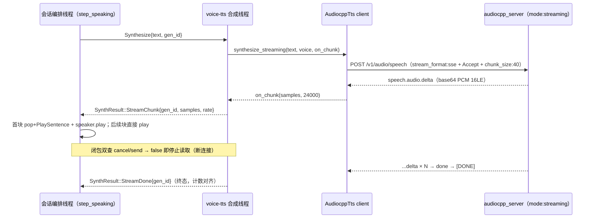

# ZapMomo TTS 流式输出（SSE 分块合成）技术方案

| 项 | 内容 |
| --- | --- |
| 文档版本 | v1.1 |
| 日期 | 2026-08-23 |
| 状态 | 已实施（阶段 1-4 自动化验收全绿；麦克风/GUI 人工项待用户执行，见 §5） |
| 范围 | omnivoice 单句内 SSE 伪流式分块输出（语音会话首响优化） |
| 前置 | PR #162（模型族描述表 / 句间热切换 / server 多实例），本方案是其 §4.10 预留点的落地 |
| 上游依赖 | [0xShug0/audio.cpp](https://github.com/0xShug0/audio.cpp) @ `release-0.6.1`（锁定） |

---

## 1. 背景与目标

### 1.1 现状与问题

语音会话链路为**句级流水线 + 句内整段合成**：LLM 流式出 token → 切句 → 每句
`POST /v1/audio/speech` 阻塞等完整 wav → speaker 播放。首响延迟构成为：

```text
首响 = 唤醒/说完判定 + LLM 首句生成 + ★整句合成耗时（Metal RTF 0.41~1.05，句越长越久）
```

PR #162 阶段 1 实测：120 字长句整段合成约 10.7~13.3s（auto）、15.2~17.4s（clone）。
句内等待是首响的最大尾延迟项。

### 1.2 目标与非目标

**目标**：

- G1：omnivoice 语音会话首句**首块音频**尽早播放（不等整句合成完）
- G2：打断（barge-in）与句间热切换（SwapEngine）在流式下不回退
- G3：非流式族（pocket_tts、sherpa 全族）行为零变化；GUI 合成页与 dsh Announcer 保持整段

**非目标**：

- voxcpm2 流式接入（上游支持，本方案结构已预留，families 表加一行即可）
- TTS 流式文本输入（上游无此端点；句级流水线已是能力上限）
- 流式音质与整段的一致性保证（伪流式块边界韵律差异见 §7 风险）

---

## 2. 阶段 1 实测（2026-08-23，macOS arm64 / Apple Silicon / Metal）

实测环境：真实 sidecar（12MB，含 omnivoice streaming）双实例（streaming / offline
两种 server config）+ python3 标准库计时脚本（绕代理、逐行流读、逐事件时间戳）。

### 2.1 四个未知项结论（设计输入）

| # | 未知项 | 结论 |
| --- | --- | --- |
| U1 | PCM 位宽 | **16-bit LE mono 24kHz**（i16 RMS 3090~5179 属合理语音电平；按 f32 解释得 nan） |
| U2 | SSE 事件字段 | 载荷键名 **`audio`**：`{"type":"speech.audio.delta","audio":"<base64>"}`；`{"type":"speech.audio.done","timing":{"ttft_ms":...}}`；`data: [DONE]` 收尾；**事件无采样率字段**（用族默认 24000，与 wav 路径实测一致） |
| U3 | streaming-mode server 是否兼容普通非流式请求 | **✓ 正常返回完整 wav**（GUI 合成页 / dsh 不受影响，回退预案不需要） |
| U4 | offline-mode server 收 SSE 请求 | **HTTP 500 拒绝** → `mode:"streaming"` 翻转是必要条件（非可选优化） |

### 2.2 决策数据：粒度扫描（120 字长句，2 次取中位）

默认 `text_chunk_size=160` 下长句只切 **1 块**，SSE 退化为整段合成完一次性吐
（首块 ≈ 总耗时，零收益）——**收益取决于粒度参数，必须显式下发**：

| chunk_size | auto 首块 | auto 总耗时 | clone 首块 | clone 总耗时 | 块数 |
| --- | --- | --- | --- | --- | --- |
| 默认 160 | 13.23s | 13.26s | 17.36s | 17.39s | 1 |
| 80 | 6.71s | 17.72s | 11.11s | 17.77s | 2 |
| **40** | **2.94s** | 16.91s | **6.33s** | 21.08s | 3 |
| 20 | 3.01s | 17.49s | 6.56s | 21.84s | 3 |

**结论**：

1. `text_chunk_size=40` 时首块延迟 **-77%（auto）/ -64%（clone）**，远超决策门槛
   （首块 ≤ 整段耗时 60%）；取 **40**（20 与 40 实测等价——块数与块均大小完全相同，
   server 侧存在有效分块下限，20 无额外收益且总耗时更差）
2. 代价：整段总耗时 +21~27%（每块有固定启动开销）。对「首块尽早开口」的会话首响
   语义是正确取舍；块间流水线使**播放与合成重叠**，用户感知的整句播完时刻接近原速
3. 短句（≤40 字，LLM 切句的主流长度）为单块，SSE ≈ 整段（首轮实测单块 SSE 总耗时
   比非流式 +5% 以内，base64 开销，可接受）
4. 首块延迟分布存档：`/tmp/omni_chunk_*.wav.times.json`；聚合音频存档
   `/tmp/omni_chunk_*.wav`（块边界韵律试听用，验收阶段人耳复核）

### 2.3 对照组（streaming-mode server，非流式请求）

| 组 | 整段耗时（中位） |
| --- | --- |
| auto 短句（15 字） | 1.48s |
| auto 长句（120 字） | 10.73s |
| clone 长句 | 15.17s |

与 PR #162 阶段 1 数据一致（RTF ~0.41 / clone ~0.68），无回归。

---

## 3. 技术方案

### 3.1 架构



### 3.2 设计决策

| # | 决策 | 理由 |
| --- | --- | --- |
| D1 | SSE（`stream_format:"sse"`）而非 raw audio | 事件框架 + 错误事件 + 完成标记；照抄 `src/llm/http.rs` 既有 blocking SSE 模式 |
| D2 | `families.rs` 加 `supports_streaming: bool`（pocket false / omnivoice true）；server_config 按族生成 `mode:"streaming"/"offline"` | §4.10 预留路径；mode 是族静态纯函数，`config_hash` 已含 model_type，无需再进 hash |
| D3 | client 新增 `synthesize_streaming(text, voice, on_chunk)`；音色映射抽 `apply_voice_fields` 与整段路径共用；请求体带 `options.text_chunk_size=40` | 复用 PR #162 三态映射（现测试保真即证等价）；粒度是收益的充要条件（§2.2） |
| D4 | 语速在 `TtsEngine::synthesize_streaming` 层处理：跨 chunk 持久 `Resampler`（speed≈1.0 零拷贝直通，末尾 flush 补尾巴） | `LinearResampler` 有相位状态，逐块独立重采样会丢余量（时长漂移 + 块界爆音）；`record_voice` 已有同模式先例 |
| D5 | `SynthResult` 加 `StreamChunk{gen_id,samples,sample_rate}` + `StreamDone{gen_id}`；chunk 不计 `synth_consumed`；「每句恰一个终态」协议 | 完成三条件 `reply_done && enqueued==consumed && drained()` 零改动 |
| D6 | synth 线程闭包双查：cancel 置位 → false（打断）；send 失败 → false（会话退出 rx drop）；两条路统一补终态 | 取消延迟 = chunk 边界，**顺带修复 audiocpp 在途 HTTP 不可中断的既有缺陷** |
| D7 | session 用纯逻辑 `SentencePlayGate` 跟踪每句首块（首块 pop + PlaySentence；零块句终态补弹） | `pending_speech` 每句恰弹一次的不变量收敛，可单测 |
| D8 | 打点：`t_wake/t_reply_start/t_first_sentence/t_first_audio` 四个 `Option<Instant>`，首次播放打一条 tracing::info；非流式路径同样打点 | A/B 验收（验收 1）的量化依据 |
| D9 | 环境变量 `ZAPMOMO_TTS_NO_STREAM` 一键回退整段路径 | A/B 测量 + 线上应急 |
| D10 | 欢迎语 `welcome_played` 只在终态置位 | rodio `drained()` 在块间空窗可能瞬时 true，首块置位会误迁移 WaitingSpeech |

### 3.3 改动面

| 文件 | 改动 |
| --- | --- |
| `src/audiocpp/families.rs` | `AudiocppFamilyDesc` 加 `supports_streaming`（流式矩阵注释） |
| `src/audiocpp/server_config.rs` | mode 按族生成；快照测试更新 |
| `src/audiocpp/client.rs` | 抽 `apply_voice_fields`；`synthesize_streaming`（SSE 解析 + `decode_pcm_chunk` i16-LE + 采样率校准）；新错误变体 `StreamingUnsupported`/`StreamEvent` |
| `src/tts/mod.rs` | 门面 `supports_streaming`（env 开关）+ `synthesize_streaming`（语速持久重采样） |
| `src/voice/synthesizer.rs` | `SynthResult` 两变体；`Synthesize` 臂按能力分流 |
| `src/voice/session.rs` | `SentencePlayGate` + step_speaking/step_greeting 分块消费 + 首响打点 |
| `Cargo.toml` | `base64 = "0.22"` |

零改动守卫：`player.rs`（append 语义天然支持分块）、`dsh/announce.rs`（只调整段
`synthesize`）、GUI 合成页与前端、sherpa 路径全部代码。

---

## 4. 分阶段实施与验收

| 阶段 | 内容 | 验收 |
| --- | --- | --- |
| 1 实测（已完成） | 双 server 矩阵 + 粒度扫描 | 本文档 §2（决策门槛 -77%/-64% 通过） |
| 2 client + 引擎层（已完成） | D2/D3/D4：families/server_config/client/TtsEngine + tiny_http SSE stub 测试 | 35 audiocpp + 71 tts 单测全绿；存量 client 测试零改动 |
| 3 会话编排（已完成） | D5/D6/D7/D8/D10：synthesizer/session + 延迟 stub 测试 | 流式序列 / 热切换混合序列 / 中途取消 ≤1s / drop 无挂起；SentencePlayGate 4 例 |
| 4 端到端验收（自动化项已完成） | 全量门禁 + 真实引擎流式 E2E + 手动清单 | 见 §5（自动化 6 项绿，人工 4 项待执行） |

## 5. 端到端验收清单

| # | 项 | 状态 | 数据/说明 |
| --- | --- | --- | --- |
| 1 | `cargo fmt --check && cargo clippy -- -D warnings && cargo test` + `cargo clippy -p zapmomo-app -- -D warnings` + 前端 `pnpm test` | ✅ 自动化通过 | 685 单测 + 集成 6 + 前端 416 全绿；根 crate 与 app crate 严格 clippy 通过 |
| 2 | 流式全链路 E2E（真实 sidecar streaming 模式 + SSE + SynthHandle 线程） | ✅ 自动化通过 | `test_omnivoice_streaming_first_chunk_latency`（--ignored）：**首块 2.58s / 流结束 8.36s / 2 块 / 14.4s 音频**——首块比整段等待提前约 6 成 |
| 3 | 首响 A/B（grep `首响打点`，`ZAPMOMO_TTS_NO_STREAM=1` 对照） | ⏳ 需人工（麦克风 + 唤醒词） | 自动化代理证据 = 项 2 + §2.2 粒度扫描；会话级打点已就位 |
| 4 | pocket / sherpa 会话零变化 | ✅ 单测级 | pocket `StreamingUnsupported` 拦截 + 存量测试零改动全绿；`ZAPMOMO_TTS_NO_STREAM` 兜底 |
| 5 | 流式播报中唤醒词打断 | ✅ 单测级（`test_streaming_cancel_mid_sentence`：终态 ≤1s）+ ⏳ 人耳 | 迟到终态 gen_id 丢弃 + 计数修复 |
| 6 | GUI Speaking 中三组合句间热切换 | ✅ 单测级（`test_streaming_swap_engine_between_sentences` 流式↔整段混合序列）+ ⏳ GUI 手动 | PR #162 手动清单重放 |
| 7 | GUI 合成页 omnivoice 整段合成 | ✅ §2.1-U3 实证兼容 + ⏳ GUI 手动 | streaming 模式 server 正常返回非流式 wav |
| 8 | 块边界韵律人耳复核 | ⏳ 需人工 | `/tmp/omni_chunk_40_*.wav`（auto/clone 两份，含逐块时间戳 json） |

## 6. 风险与回退

| # | 风险 | 等级 | 对策 |
| --- | --- | --- | --- |
| R1 | 块边界韵律断裂（伪流式各块独立合成） | 中 | 人耳验收（§5-7）；`ZAPMOMO_TTS_NO_STREAM=1` 一键回退；粒度常量可调（40→80 减半边界数） |
| R2 | 小粒度总耗时 +21~27%，长句播完时刻后移 | 低 | 播放与合成重叠，感知播完 ≈ 首块延迟 + 剩余块流水；短句（主流）单块无影响 |
| R3 | 块间 server 停滞导致取消不及时 | 低 | 取消延迟 = chunk 边界；停滞上限仍是 120s 请求超时（与现状同界） |
| R4 | 上游 SSE schema 漂移（事件字段名变更） | 低 | 解析集中在 client 一处；快照 stub 测试锁定 |
