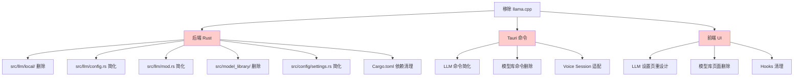

# 移除 llama.cpp 本地模型能力 — 可行性分析报告

## 1. 现状分析

### 1.1 当前 LLM 架构概览

项目当前 LLM 模块采用 **provider 抽象层** 设计，支持两种后端：

```
┌─────────────────────────────────────────────┐
│              LlmEngine (门面)                │
│  生命周期管理 / worker 线程 / 事件广播        │
├─────────────────────────────────────────────┤
│          LlmProvider (trait 抽象)            │
├─────────────────────┬───────────────────────┤
│  LocalLlamaProvider │  OpenAiChatProvider   │
│  (llama-cpp-2)      │  (async-openai)       │
│  本地 GGUF 模型推理  │  OpenAI 兼容 API      │
└─────────────────────┴───────────────────────┘
```

### 1.2 涉及模块清单

| 模块 | 路径 | 行数（估） | 说明 |
|------|------|-----------|------|
| **llama provider** | `src/llm/local/llama.rs` | ~387 | 唯一直接依赖 llama-cpp-2 的代码 |
| **llama provider mod** | `src/llm/local/mod.rs` | ~5 | 重导出 |
| **LLM 引擎** | `src/llm/mod.rs` | ~395 | provider 分发逻辑（`create_provider`） |
| **LLM 配置** | `src/llm/config.rs` | ~301 | 模型路径解析、GGUF 发现 |
| **LLM 错误** | `src/llm/error.rs` | ~40 | 错误类型 |
| **模型库 core** | `src/model_library/` | ~2500+ | 10 个文件，含 LLM 下载/安装/GGUF 校验 |
| **模型库 registry** | `src/model_library/registry.rs` | ~800 | 内置模型清单（含 LLM 条目） |
| **模型库 catalog** | `src/model_library/catalog.rs` | ~600 | HF 目录浏览 |
| **模型库 download** | `src/model_library/download.rs` | ~500 | HF 下载 |
| **模型库 install** | `src/model_library/install.rs` | ~400 | 安装管理 |
| **模型库 gguf** | `src/model_library/gguf.rs` | ~100 | GGUF 解析 |
| **模型库 huggingface** | `src/model_library/huggingface.rs` | ~300 | HF API 客户端 |
| **模型库 compat** | `src/model_library/compat.rs` | ~200 | 兼容性检查 |
| **模型库 verified** | `src/model_library/verified.rs` | ~200 | 已验证模型注册 |
| **模型库 storage** | `src/model_library/storage.rs` | ~200 | 存储管理 |
| **模型库 sysinfo** | `src/model_library/sysinfo.rs` | ~100 | 系统资源 |
| **Settings** | `src/config/settings.rs` | ~1456 | LlmSettings + ModelLibrarySettings |
| **Tauri commands** | `src-tauri/src/lib.rs` | ~6470 | 大量 LLM 相关命令 |
| **前端 hooks** | `frontend/src/hooks/` | ~ | 多个 LLM/模型库相关 hooks |
| **前端 types** | `frontend/src/types/` | ~ | modelLibrary.ts, catalog.ts |

### 1.3 Cargo 依赖

需要移除的依赖（仅被 llama.cpp/模型库使用）：

| 依赖 | 用途 | 是否可移除 |
|------|------|-----------|
| `llama-cpp-2 = "0.1.154"` | 本地 LLM 推理 | ✅ 移除 |
| `encoding_rs = "0.8"` | llama token 解码 | ✅ 移除（仅 llama.rs 使用） |
| `sysinfo = "0.33"` | 模型库系统资源卡片 | ✅ 移除（仅模型库使用） |
| `ureq = "3"` | 模型下载 HTTP | ⚠️ 也用于 KWS/ASR/TTS 模型下载 |
| `sha2 = "0.11"` | 模型下载校验 | ⚠️ 也用于 KWS/ASR/TTS 模型下载 |
| `hex = "0.4"` | 模型下载校验 | ⚠️ 也用于 KWS/ASR/TTS 模型下载 |
| `tar = "0.4"` | 模型解压 | ⚠️ 也用于 KWS/ASR/TTS 模型下载 |
| `bzip2 = "0.6"` | 模型解压 | ⚠️ 也用于 KWS/ASR/TTS 模型下载 |

### 1.4 远程 LLM 能力（已存在，保留）

项目已经完整支持远程 LLM：

- **`OpenAiChatProvider`**（`src/llm/http.rs`，667 行）：完整的 OpenAI 兼容 Chat Completions 实现
- **Settings 字段**：`base_url`、`api_key`、`model` 已在 `LlmSettings` 中定义
- **已测试通过**：mock SSE server 测试覆盖文本流、tool call 合并、错误处理、取消等
- **支持平台**：智谱 GLM、DeepSeek、OpenRouter、任何兼容 `/v1/chat/completions` 的服务

## 2. 移除范围分析

### 2.1 明确移除的内容

#### A. Rust 后端

| 文件/目录 | 操作 | 风险 |
|-----------|------|------|
| `src/llm/local/` 整个目录 | 删除 | 低 |
| `src/model_library/` 整个目录 | 删除 | 中（依赖 `kws::model` 的下载基础设施） |
| `Cargo.toml`: `llama-cpp-2`, `encoding_rs`, `sysinfo` | 移除依赖 | 低 |
| `src/llm/config.rs`: GGUF 发现、默认模型路径 | 大幅简化 | 低 |
| `src/llm/mod.rs`: `create_provider` 分发 | 简化 | 低 |
| `src/config/settings.rs`: `LlmSettings` 中本地模型字段 | 简化 | 低 |
| `src/config/settings.rs`: `ModelLibrarySettings` | 移除 | 中 |
| `src/config/settings.rs`: `LocalModel` | 移除 | 中 |

#### B. Tauri 命令层

| 命令 | 操作 |
|------|------|
| `download_llm_model` | 删除 |
| `set_llm_model_path` | 删除（改为设置 URL/Key） |
| `load_llm_model` / `unload_llm_model` | 简化（远程无需加载/卸载） |
| `get_llm_config` | 修改（返回 URL/Key/Model 配置） |
| `is_llm_ready` | 简化（远程始终 ready） |
| 模型库相关命令（`list_models`, `download_model`, `delete_model`, `set_current_model` 等） | 删除或大幅简化 |

#### C. 前端

| 组件/Hook | 操作 |
|-----------|------|
| `useLlmModelDownload.ts` | 删除 |
| `useModelLibrary.ts` | 删除 |
| `useModelDownload.ts` / `useModelDownloads.ts` | 删除或限制为非 LLM |
| 模型库页面/组件 | 删除 LLM 部分 |
| LLM 设置页 | 重新设计（只保留 URL/Key/Model 输入） |

### 2.2 需要保留的内容

| 内容 | 原因 |
|------|------|
| `src/llm/http.rs` (`OpenAiChatProvider`) | 核心远程 LLM 能力 |
| `src/llm/provider.rs` (trait) | 可能仍需（或简化为具体类型） |
| `src/llm/agent.rs` | Agent loop（工具调用） |
| `src/llm/tools.rs` | 工具定义 |
| `src/llm/types.rs` | 共享类型 |
| `src/llm/error.rs` | 错误类型 |
| `src/llm/mod.rs` (`LlmEngine`) | 门面，但需简化 |
| `async-openai` 依赖 | 远程 API 调用 |
| `reqwest` 依赖 | HTTP 客户端 |
| `futures-util` 依赖 | 异步流处理 |
| KWS/ASR/TTS 模型下载基础设施 | 其他能力仍需要 |

### 2.3 需要特别注意的耦合点

1. **模型库下载基础设施共享**：`model_library` 的下载/安装逻辑高度依赖 `kws::model` 的 `ModelAsset`/`install_asset_to_cancellable` 等函数。这些函数也用于 KWS/ASR/TTS 的模型下载。移除 LLM 模型下载不影响其他能力。

2. **Settings 结构**：`AppConfig.model_library` 字段存有 `ModelLibrarySettings`（含 `local_models`、`hf_catalog_base_url` 等）。移除后 `AppConfig` 结构体需更新。

3. **Tauri State**：`LlmState` 和 `ModelLibraryState` 在 Tauri 层管理，移除后需更新。

4. **Voice Session**：语音会话依赖 `LlmEngine` 进行 LLM 推理。只要 `LlmEngine` 保留（改为只使用远程 provider），语音会话不受影响。

## 3. 实施方案分析

### 3.1 方案概述

**总体思路**：移除本地 llama.cpp 推理 + 模型库管理层，保留并简化远程 LLM 能力。用户通过 settings 配置自己的 API URL 和 Key，前端只需提供对应的设置表单。

### 3.2 具体变更

#### 阶段 1：后端核心变更

**1.1 移除 `src/llm/local/` 目录**
- 删除 `src/llm/local/llama.rs`
- 删除 `src/llm/local/mod.rs`

**1.2 简化 `src/llm/config.rs`**
- 移除 `DEFAULT_MODEL_NAME`、`DEFAULT_MODEL_FILE`、`default_model_path()`
- 移除 `discover_gguf()`、`discover_gguf_in()`
- 移除 `default_threads()`
- 移除 `ResolvedLlmConfig.model_path` 字段（远程不需要本地路径）
- 移除 `ResolvedLlmConfig` 中的 `context_size`、`batch_size`、`threads`、`gpu_layers`、`enable_thinking`、`auto_load` 等本地专属字段
- 简化 `resolve()` 函数

**1.3 简化 `src/llm/mod.rs`**
- `create_provider()` 只保留 `OpenAiChatProvider` 分支
- `LlmEngine` 简化（远程 provider 无需 load/unload）
- worker loop 简化

**1.4 简化 `src/llm/error.rs`**
- 移除 `ModelNotFound`、`InvalidModel`、`ContextOverflow` 等本地专属错误

**1.5 简化 `src/config/settings.rs`**
- `LlmSettings` 移除本地专属字段：`model_path`、`context_size`、`batch_size`、`threads`、`gpu_layers`、`enable_thinking`、`auto_load`
- 保留远程字段：`enabled`、`provider`、`system_prompt`、`temperature`、`top_p`、`max_tokens`、`base_url`、`api_key`、`model`
- 移除 `ModelLibrarySettings` 和 `LocalModel`
- `AppConfig` 移除 `model_library` 字段

**1.6 移除 `src/model_library/` 整个目录**

**1.7 更新 `Cargo.toml`**
- 移除 `llama-cpp-2`
- 移除 `encoding_rs`
- 移除 `sysinfo`

#### 阶段 2：Tauri 命令层变更

**2.1 `src-tauri/src/lib.rs`**
- 移除 `use zapmomo::model_library` 相关导入
- 移除 `download_llm_model` 命令
- 移除 `set_llm_model_path` 命令
- 简化 `load_llm_model` / `unload_llm_model`（远程无需加载）
- 简化 `get_llm_config`（返回远程配置）
- 移除所有模型库相关命令（`list_models`、`get_model_library`、`download_model`、`delete_model`、`set_current_model`、`get_system_resources` 等）
- 移除 `ModelLibraryState`
- 更新 voice session 中的 LLM 交互逻辑

#### 阶段 3：前端变更

**3.1 移除模型库相关**
- 删除 `useModelLibrary.ts`
- 删除 `useLlmModelDownload.ts`
- 删除 `useModelDownload.ts` / `useModelDownloads.ts`（或限制为非 LLM）
- 删除模型库页面组件
- 删除 `types/modelLibrary.ts`、`types/catalog.ts`

**3.2 简化 LLM 设置页**
- 移除模型选择/下载 UI
- 改为：Provider URL 输入框 + API Key 输入框 + Model 名称输入框
- 保留 system prompt、temperature、max_tokens 等通用参数

**3.3 更新 `useLlm.ts`**
- 移除模型加载/卸载逻辑
- 简化状态管理

#### 阶段 4：测试与清理

**4.1 更新测试**
- 移除 `src/llm/local/llama.rs` 中的测试
- 移除 `src/llm/config.rs` 中的本地模型相关测试
- 移除 `src/model_library/` 中的测试
- 移除 `src/config/settings.rs` 中 `ModelLibrarySettings` 相关测试
- 更新 `src/llm/mod.rs` 中的测试
- 更新 `src/llm/http.rs` 中的测试（确认仍通过）

**4.2 代码质量**
- `cargo fmt --check`
- `cargo clippy -- -D warnings`
- `cargo test`
- `cargo check -p zapmomo-app`

### 3.3 影响范围总结



## 4. 风险评估

| 风险 | 等级 | 缓解措施 |
|------|------|---------|
| Voice Session 断裂 | 中 | 远程 provider 已存在且测试通过，LlmEngine 接口不变 |
| KWS/ASR/TTS 模型下载受影响 | 低 | 下载基础设施在 `kws::model` 中，独立于 `model_library` |
| 用户配置迁移 | 低 | `LlmSettings` 中远程字段（base_url/api_key/model）已存在，无需迁移 |
| 前端编译错误 | 中 | TypeScript 类型需大量更新 |
| 测试覆盖下降 | 低 | 移除的测试与移除的代码对应，远程测试保留 |

## 5. 分析结论

### 5.1 可行性：✅ 完全可行

移除 llama.cpp 本地模型能力在技术上是**完全可行**的，理由如下：

1. **远程 LLM 能力已完整实现**：`OpenAiChatProvider` 已经过充分测试，支持流式生成、工具调用、错误处理、取消等完整功能。

2. **Provider 抽象层设计良好**：`LlmProvider` trait 和 `LlmEngine` 门面设计使得移除一种 provider 实现不会破坏架构。

3. **Settings 已预留远程字段**：`base_url`、`api_key`、`model` 字段已在 `LlmSettings` 中定义，用户配置迁移成本为零。

4. **模型库与其他能力解耦**：KWS/ASR/TTS 的模型下载使用的是 `kws::model` 模块的基础设施，与 `model_library` 无关。

### 5.2 工作量估算

| 阶段 | 预估变更量 | 难度 |
|------|-----------|------|
| 阶段 1：后端核心 | ~3000 行删除，~200 行修改 | 中 |
| 阶段 2：Tauri 命令 | ~500 行删除，~100 行修改 | 中 |
| 阶段 3：前端 | ~1500 行删除，~200 行新增 | 中 |
| 阶段 4：测试 | ~500 行删除/更新 | 低 |
| **总计** | **~5500 行净删除，~500 行修改/新增** | **中** |

### 5.3 建议

1. **保留 `LlmProvider` trait**：虽然只剩一种实现，但保留 trait 为未来扩展（如 Ollama provider、Anthropic provider）留有余地。

2. **保留 `LlmEngine` 门面**：简化其内部逻辑（移除 load/unload window），但保持对外接口不变，确保 voice session 和前端无需大幅改动。

3. **保留 `src/llm/types.rs` 和 `src/llm/agent.rs`**：Agent loop 和类型定义与 provider 无关，继续使用。

4. **分阶段实施**：建议按上述 4 个阶段依次实施，每个阶段完成后运行完整测试套件确认无回归。