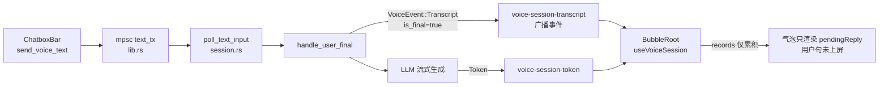

# 设计：聊天气泡展示用户输入（先用户句、后角色回复）

- 日期：2026-08-28
- 状态：已评审定稿
- 关联：`2026-08-28-bubble-manual-dismiss-design.md`（气泡静置 + 点击关闭，本设计在其之上叠加）

## 1. 现状分析

用户通过底部输入条（chatbox 窗口）与角色对话时，气泡（bubble 窗口）只展示角色的流式
回复，用户输入的内容不上屏。从发送到首 token 到达之间存在无反馈空窗；语音（ASR）对
话同样只有回复上屏，用户无法确认「它听到了什么」。

现状数据流（打字输入路径）：

**关键事实：气泡窗口此刻已经能拿到用户输入文本。** `handle_user_final` 对打字与语音
最终文本同源发出 `Transcript { is_final: true }`，经 `make_voice_emit` 广播为
`voice-session-transcript`；`BubbleRoot` 使用的 `useVoiceSession` 已订阅该事件（仅累积
进 `records` 供对话记录页使用）。因此本设计为**纯前端改动，后端零改动**。

已确认的需求边界：打字与语音识别文本**都**上气泡（两者事件同源无法区分，统一展示交
互体验一致，且零后端改动）。

## 2. 架构分析

- **窗口拓扑**：chatbox（输入条）、companion（角色）、bubble（气泡）是三个独立
  WebView 窗口，共享后端事件广播。气泡内容由 `VoiceReplyBubble` 统一管理两路来源：
  流式回复（`pendingReply`）与 dsh 插播（`announcement`），流式优先级恒高于插播。
- **生命周期语义**：内容一旦出现即静置常驻，唯一消失途径是用户点击（或新一轮内容顶
  替）；空闲时窗口点击穿透。本设计必须延续这套哲学。
- **改动落点**：全部在前端两层——`useVoiceSession`（状态）、`VoiceReplyBubble` +
  `BubbleRoot`（渲染）。

## 3. 方案设计

### 3.1 内容模型：气泡从「单一回复视图」升级为「一轮对话视图」

当前轮 = 用户句（可选） + 流式回复（可选）。

### 3.2 状态归属：`useVoiceSession` 新增 `turnUserText: string`

- 在现有 `onVoiceSessionTranscript` 订阅点内，`is_final: true` 时
  `setTurnUserText(p.text)`——与 `records` 累积共用同一订阅，零额外事件开销。
- **不主动清零**：延续「想看的内容不被程序收走」——打断（barge-in）、会话停止时保留；
  只被「下一轮 transcript 顶替」或「气泡点击关闭」清除。
- `start()` 时不清（与静置语义一致；新一轮 transcript 自然顶替）。

### 3.3 气泡渲染：`VoiceReplyBubble` 新增 `userText` prop

- 用户句到达即上屏（此刻回复为空，气泡先亮出用户句，消除首 token 前的空窗）。
- token 到达 → 用户句下方流式追加回复（现有打字机机制不变）。
- reply-finished → 静置保留最后一帧（现有机制不变）。
- 新一轮 `userText` 到达 → 顶替旧轮全部内容（含旧回复），符合「新一轮文本到达自然顶
  替」既有语义。

### 3.4 插播压制语义微调

现有「流式回复压制 dsh 插播」扩展为「**用户句或**流式回复存在即压制」：堵住「消息刚
发出、回复未始」窗口期内插播抢屏的缝隙。被压制的插播仍走 5s 新鲜期（补展示/超期丢弃）
逻辑，行为不变。

### 3.5 交互边界

| 场景 | 行为 |
| --- | --- |
| 点击关闭 | dismiss 一次性清空三路内容（用户句/回复/插播），窗口回点穿态 |
| 流式进行中点击 | 不响应（保持现状：内容未定稿，点了也会被下一 token 顶回） |
| 可见性判定 | `userText \|\| visibleText` 非空即可见，驱动现有点穿切换 |
| 播报中语音打断 | 新一轮 transcript 自然顶替旧轮，无需额外处理 |
| 连发多条消息 | 后端 `pending_texts` 排队逐条处理，气泡始终呈现最新一轮 |

### 3.6 样式（适配 galgame 紧凑气泡，不照搬 ChatPage 左右布局）

- 用户句块：`text-xs` + muted 弱化色 + 「我：」前缀；回复保持现有 `text-sm` 主体地位
  ——视觉层级即「你说的 / 它答的」。
- 容器 `max-h-32`（128px）→ `max-h-44`（176px）：用户句 `line-clamp-2`、回复
  `line-clamp-4`，超长截断哲学不变。
- 拖动、把手、26px 阴影边距等窗口级交互全部不动。

## 4. 实施清单

1. `useVoiceSession.ts`：新增 `turnUserText` state + `VoiceSessionState` 接口字段；
   在 `is_final` 分支置位；更新 hook 文档注释。
2. `VoiceReplyBubble.tsx`：新增 `userText` prop；渲染两段布局；插播压制条件扩展为
   `text || userText`；dismiss 清空用户句；可见性上报含用户句。
3. `BubbleRoot.tsx`：透传 `voice.turnUserText`。
4. 测试增量（不删现有用例）：
   - `VoiceReplyBubble.test.tsx`：用户句先亮、回复下方追加、新轮顶替、插播被用户句压
     制、dismiss 清空、可见性上报。
   - `useVoiceSession.test.tsx`：`turnUserText` 置位/顶替/保留（打断不清）。
5. 验收命令：`pnpm tsc -b`（根目录 `tsc --noEmit` 空通过，须用 `-b`）+ vitest；
   `pnpm tauri dev` 手动验收打字/语音两路。

## 5. 验收标准

1. 输入条发送消息后，气泡立即显示「我：」+ 用户句；角色回复在其下方流式追加。
2. 语音对话中，ASR 最终识别文本同样先上气泡，回复随后追加。
3. 打断/停止后气泡内容静置保留；点击气泡一次性关闭；新一轮对话自然顶替。
4. dsh 插播不在用户句/回复展示期间抢屏，新鲜期语义与现状一致。
5. 空闲（无内容）时气泡窗口保持点击穿透；现有拖动、位置持久化行为无回归。
