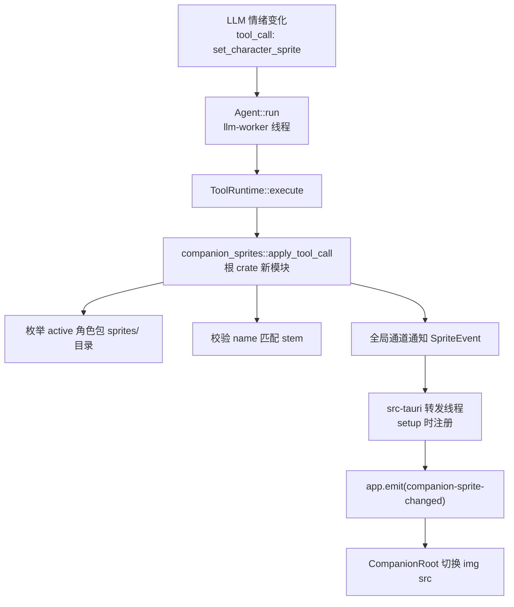

# LLM 切换角色形象（set_character_sprite 工具）设计

- 日期：2026-08-29
- 状态：已确认（LLM 情绪驱动、会话态不持久化）

## 1. 现状分析

- 角色包伙伴（`format = "character"`）托管目录含 `character.md`（人设）、`character.png`
  （默认立绘）、可选 `voice/`（音色克隆参考）。用户可自放 `sprites/` 子目录，按文件名
  stem 表意（如 `happy.png`、`angry.png`），当前前后端均无任何代码引用该目录。
- 前端角色窗口 `CompanionRoot` 对角色包走 `GifStage`（原生 ``），
  URL 由 `toAssetUrl()` 把托管目录内绝对路径转 `asset://` 协议；
  事件订阅统一走 `lib/tauri.ts` 的 `onXxx` 包装。
- 根 crate 的 `ToolRuntime`（`src/llm/tools.rs`）在 llm-worker 线程实例化（`llm/mod.rs`
  worker_loop），`Agent::run` 每轮调 `definitions()` 生成工具清单、`execute()` 执行；
  模型可见的失败一律转为结果文本（失败即结果），`Err` 会中断 Agent Loop。
- 人设注入：`voice::config::apply_companion_overrides` 用 character.md 全文替换 system prompt。
- 根 crate 不依赖 Tauri；跨 crate 通知需经 src-tauri 的事件桥（`app_handle.emit` → 前端 `listen`）。

## 2. 架构与数据流



设计支点：

1. **动态注册**：`definitions()` 每轮探测 active 角色包的 `sprites/` 目录。
   非角色包 / 目录缺失 / 为空 → 工具不进 `tools` 参数，LLM 无从误调；
   中途加图下一轮自动可见。
2. **列表内联进工具描述**：文件名 stem 即语义，LLM 直接理解，无需 `list_sprites` 工具。
3. **全局通知通道**：根 crate 暴露 `register_notifier(mpsc::Sender<SpriteEvent>)`，
   src-tauri setup 时注册并 spawn 常驻转发线程。不穿透 `LlmEngine`/`Agent`/`ToolRuntime`
   签名；主窗口 `chat_llm` 与语音会话两条 LLM 路径天然都能触发。
   未注册（CLI / 测试）时通知为 no-op。
4. **会话态**：不持久化。启动、切换伙伴时前端回默认 `character.png`；
   根 crate 不保存「当前形象」状态，前端以事件载荷的绝对路径渲染。

## 3. 接口设计

### 根 crate：`src/companion_sprites.rs`

```rust
pub struct SpriteEvent { companion_id: String, name: String, path: String }
pub struct SpriteInfo { name: String, path: PathBuf }

/// 枚举 active 角色包 sprites/ 下的形象（仅一层目录，stem 排序）。
/// 支持 png / gif / webp，stem 冲突按 png > gif > webp 取优先。
/// 非 active 角色包 / 目录缺失 → 空 Vec。
pub fn list_active_sprites() -> Vec<SpriteInfo>;

/// 工具执行入口（返回给模型的文本，永远 Ok 文本，失败即结果）。
/// - {"name": "happy"}  → 命中 stem → 发事件，返回「已切换」
/// - {"name": "default"} → path = character.png（恢复默认立绘）
/// - 未知名 / 缺参      → 返回可用列表提示，不中断 Agent Loop
pub fn apply_tool_call(arguments: &str) -> String;

/// src-tauri setup 时注册；通道 send best-effort，无注册者时静默跳过。
pub fn register_notifier(tx: mpsc::Sender<SpriteEvent>);
```

安全性：LLM 输入的 name 只与枚举出的 stem 做大小写不敏感匹配，
从不拼接路径，路径穿越在构造上不可能。

### ToolRuntime（`src/llm/tools.rs`）

- `definitions()`：`list_active_sprites()` 非空时追加
  `set_character_sprite`，描述内联可用形象名 + `default` 说明 + 调用时机提示
  （情绪明显变化时调用，可与回复同轮发出）。
- `execute()`：新增 `"set_character_sprite"` 分支。

### src-tauri（`src-tauri/src/lib.rs` setup）

`(tx, rx) = mpsc::channel()` → `register_notifier(tx)` → 常驻线程
`rx.recv()` 循环 `app_handle.emit("companion-sprite-changed", ev)`。

### 前端

- `types/tauri.ts`：`CompanionSpriteEvent { companion_id, name, path }`。
- `lib/tauri.ts`：`onCompanionSpriteChanged` 包装。
- `CompanionRoot.tsx`：`spriteOverride` 状态；
  事件到达且 `companion_id` 匹配当前伙伴 → `spriteOverride = ev.path`，
  GifStage 的 url 用 `spriteOverride ?? stage.url`；
  `live2d-model-changed`（切换伙伴）时重置为 `null`。

## 4. 边界与决策

| 场景 | 行为 |
| --- | --- |
| Live2D / GIF 伙伴 | 工具不注册 |
| sprites/ 目录中途加图 | 下一轮 `definitions()` 自动可见 |
| 未知 sprite 名 | 结果文本列可用名，模型自行纠正，Loop 不中断 |
| 大小写（Happy vs happy） | 匹配忽略大小写 |
| 事件飞行中切换伙伴 | 前端校验 companion_id，不匹配则忽略 |
| 切伙伴 / 重启 | 回默认 character.png（会话态） |
| 形象尺寸与默认立绘不同 | 复用 GifStage onLoad 上报 naturalWidth/Height 的既有机制自适应窗口 |
| 无注册者（CLI / 测试） | 通知 no-op，apply 正常返回 |
| Agent 同轮文本 + 工具调用 | 文本照常流式，工具在响应结束后执行（现状行为，够用） |

范围外（后续版本）：语音状态（listening/speaking）自动映射、形象持久化、
主窗口 CurrentCompanionCard 联动。

## 5. 实施方案

单阶段交付，TDD（每步先写失败测试）：

1. 根 crate `companion_sprites.rs`：枚举 / 校验 / 通知 + 单测（temp HOME）。
2. `tools.rs` 集成：gating + 分派；现有 definitions 相关测试补 `run_with_temp_home`。
3. src-tauri：setup 注册 + 转发线程（逻辑薄，靠根 crate 单测覆盖语义）。
4. 前端：类型 + 事件包装 + CompanionRoot 接线 + vitest。
5. 文档：角色包设计文档补 `sprites/` 可选目录说明。

验收：`cargo fmt --check`、`cargo clippy`（CI 口径，不带 `--all-targets`）、
`cargo test` 全绿；前端 `tsc -b`、`vitest run` 全绿。
